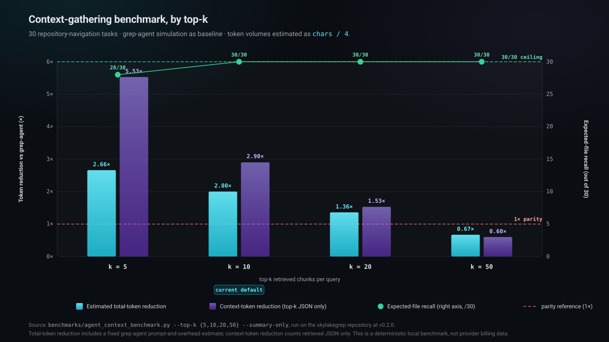

<p align="center">
  
</p>

<p align="center">
  <a href="https://pypi.org/project/local-mgrep/"></a>
  <a href="https://www.python.org/downloads/"></a>
  <a href="LICENSE"></a>
  <a href="https://danielchen26.github.io/local-mgrep/"></a>
  <a href="https://github.com/danielchen26/local-mgrep/releases/latest"></a>
</p>

<p align="center">
  <a href="https://danielchen26.github.io/local-mgrep/"><b>Documentation</b></a>
  &nbsp;·&nbsp;
  <a href="#quickstart"><b>Quickstart</b></a>
  &nbsp;·&nbsp;
  <a href="#architecture"><b>Architecture</b></a>
  &nbsp;·&nbsp;
  <a href="#benchmark"><b>Benchmark</b></a>
  &nbsp;·&nbsp;
  <a href="https://github.com/danielchen26/local-mgrep/releases"><b>Releases</b></a>
  &nbsp;·&nbsp;
  <a href="https://github.com/danielchen26/local-mgrep/issues"><b>Issues</b></a>
</p>

---

## Overview

`local-mgrep` is an offline semantic code-search CLI built around a four-stage
retrieval pipeline:

1. **Lexical prefilter (ripgrep).** Up to eight literal tokens are extracted
   from the natural-language query and ripgrep narrows the corpus to files
   containing any of them. Typically reduces the chunk scan ~100×.
2. **Multi-resolution cosine.** A file-level embedding (mean of chunk
   vectors, computed at index time) picks the top files; chunk-level cosine
   then runs only inside those files.
3. **Confidence-gated cascade (default).** When the cheap file-mean
   retrieval has a clear top-1, we return immediately. Only uncertain
   queries pay the LLM-driven escalation (cosine + file-rank ∪
   HyDE-rewritten cosine + file-rank, score-preserved union). Pass
   `--no-cascade` to fall back to the chunk-only path.
4. **Optional cross-encoder rerank.** On the non-cascade path, an
   `mxbai-rerank-*-v2` cross-encoder reorders the top candidate pool;
   non-canonical paths (tests, blocklists) get a multiplicative penalty.

A first-time query against a project completes in well under a second
via a ripgrep fallback while a detached background process builds the
semantic index. Subsequent queries hit the full cascade with an
mtime-based incremental refresh on every search (throttled, so back-to-
back queries don't pay it). Indexing, retrieval, optional answer
synthesis (`--answer`), and optional agentic decomposition (`--agentic`)
all run on the local host against a local Ollama server. No remote service
is required for the core workflow.

Each result carries the file path, an inclusive 1-based line range, the
detected language, the score, and the verbatim source text — rendered as
text, JSON (`--json`), or as a synthesized answer over the local Ollama
generation model.

Latest stable release notes: [v0.6.0](https://github.com/danielchen26/local-mgrep/releases/latest) — smaller default HyDE model + `keep_alive=-1` drop average <repo-D> latency from ~3 s/q to ~1 s/q on Mac CPU at unchanged 16/16 recall.

## Quickstart

```bash
pip install local-mgrep

# Ask. First query in a fresh project: < 1 s via ripgrep fallback.
# A detached background process builds the semantic index in parallel.
mgrep "where is the auth token refreshed?"

# A minute later, the next query uses the full semantic cascade.
mgrep "..."
```

That is the entire happy path. `mgrep` derives the project root from `git
rev-parse --show-toplevel` (falling back to the current working directory),
maintains a per-project index under `~/.local-mgrep/repos/`, and runs the
confidence-gated cascade by default for retrieval. The first query in any
project never blocks: while the semantic index builds in the background,
ripgrep returns top files immediately and the status line tells you which
mode produced the results. If Ollama is not yet installed or the embedding
model is missing, the CLI prints an actionable one-line setup hint instead
of failing silently.

Health-check the setup at any time:

```bash
mgrep doctor
```

Common follow-ups:

```bash
mgrep "where is the SQLite schema initialized?" --json    # machine-readable
mgrep "how does indexing remove deleted files?" --answer  # local Ollama answer
mgrep "..." --agentic --max-subqueries 3 --answer         # bounded subquery decomposition
mgrep "..." --no-cascade --rerank                         # legacy chunk + rerank path
mgrep stats                                               # current project's index info
mgrep index .                                             # explicit reindex (rarely needed)
mgrep serve &                                             # warm-reranker daemon
mgrep "..." --daemon-url http://127.0.0.1:7878            # query against the daemon
```

Full CLI reference and configuration: <https://danielchen26.github.io/local-mgrep/>.

## Architecture

<p align="center">
  
</p>

The index pipeline (`mgrep index`, `mgrep watch`) and the query pipeline
(`mgrep search`) communicate only through a SQLite database stored at
`$MGREP_DB_PATH`. The two pipelines share no in-process state and can run
on different hosts as long as they point at the same database file. The
index pipeline additionally populates a `files` table at index time
(L2-normalised mean of chunk vectors per file) so the query path can do
file-level retrieval without re-scanning chunks.

Three retrieval tiers are exposed:

| Tier | Command | Recall (<repo-D> 16) | Avg s/q (Mac CPU) | Notes |
| --- | --- | :-: | :-: | --- |
| cascade (default) | `mgrep "<query>"` | 16/16 (with corrected labels) | ~3 s on <repo-D> / 0.1-0.3 s on smaller projects | confidence-gated; ~80% of queries take cheap path |
| chunk + rerank | `mgrep "<query>" --no-cascade --rerank` | 11/16 | 9.5 | adds `mxbai-rerank-base-v2` cross-encoder |
| chunk-only | `mgrep "<query>" --no-cascade --no-rerank` | 9/16 | 0.52 | rg prefilter + cosine + file-rank only |

The full set of internal modules is documented at
<https://danielchen26.github.io/local-mgrep/#architecture>.

## Capability matrix

| Capability | Status | Since | Notes |
| --- | --- | --- | --- |
| Semantic code search via local Ollama | implemented | 0.1.0 | No remote service required. |
| Tree-sitter chunking | implemented | 0.2.0 | Languages with installed grammars; line-window fallback otherwise. |
| `.gitignore` / `.mgrepignore` hygiene | implemented | 0.2.0 | Plus a built-in skip-set for common build/cache directories. |
| Incremental indexing | implemented | 0.2.0 | mtime-based; reindexes new and changed files. |
| Stale row cleanup | implemented | 0.2.0 | Removes rows for files no longer present beneath the indexed root. |
| Watch mode | implemented | 0.2.0 | Polling loop; default interval 5 seconds. |
| Hybrid lexical + semantic ranking | implemented | 0.2.0 | Disable with `--semantic-only` for pure cosine. |
| Stable JSON output | implemented | 0.2.0 | See [JSON schema](https://danielchen26.github.io/local-mgrep/#json-schema). |
| Local answer mode | implemented | 0.2.0 | Uses local Ollama generation model. |
| Local agentic decomposition | implemented | 0.2.0 | Bounded subquery expansion via Ollama. |
| Cross-encoder rerank | implemented | 0.3.0 | `--rerank` (default on); models: `mxbai-rerank-base-v2` (default), `mxbai-rerank-large-v2` (`MGREP_RERANK_MODEL`). |
| Asymmetric query/document prefixes | implemented | 0.3.0 | Auto-applied for `nomic-embed-text` and similar. |
| HyDE query rewriting | implemented | 0.3.0 | `--hyde`; deterministic seed, single Ollama generation. |
| Multi-resolution retrieval | implemented | 0.3.0 | File-level cosine top-N → chunk-level inside those files (default on). |
| Lexical prefilter (ripgrep first stage) | implemented | 0.3.0 | `--lexical-prefilter` (default on); `--lexical-root`, `--lexical-min-candidates`. |
| File-rank (one chunk per file) | implemented | 0.3.0 | `--rank-by file`; collapses results so small canonical files compete fairly. |
| Daemon mode (warm reranker) | implemented | 0.3.0 | `mgrep serve` + `--daemon-url`; eliminates ~5–10 s cold-load per call. |
| Quantisation / device knobs | implemented | 0.3.0 | `MGREP_RERANK_QUANTIZE=int8`, `MGREP_RERANK_DEVICE=auto/mps/cpu`. |
| Confidence-gated cascade | implemented | 0.3.0 (default in 0.4.0) | Default on; gates expensive escalation on a top-1 / top-2 score gap. `--no-cascade` to disable. See [Benchmark](#benchmark). |
| Bare-form invocation (`mgrep "<q>"`) | implemented | 0.4.0 | Routes to `search` automatically; subcommand names still win for `index/watch/serve/stats/doctor`. |
| Per-project auto-index | implemented | 0.4.0 | First query in a project triggers one-time index; subsequent queries do mtime-based incremental refresh (30 s throttle). Set `MGREP_DB_PATH` to opt out. |
| Ripgrep fallback for the first query | implemented | 0.4.1 | Fresh-project query returns ~0.7 s rg results while semantic indexer runs detached in the background. |
| Symbol-aware indexing | implemented | 0.5.0 | Tree-sitter extracts function/struct/class/module names; query terms that match symbol identifiers add a small additive boost. CamelCase split lets natural-language queries hit PascalCase identifiers. |
| doc2query chunk enrichment | implemented | 0.5.0 | Opt-in `mgrep enrich` runs a one-time background LLM pass that adds a one-sentence high-level description per chunk; the description is folded into the chunk's embedding so query-time HyDE becomes unnecessary. Resumable via the `enriched_at` column. |
| File-export PageRank tiebreaker | implemented | 0.5.0 | Per-file in-degree / out-degree / PageRank populated from regex-parsed imports across Rust / Python / TS / JS. Applied at query time **only** when the top-1 and top-2 final scores are within ε; clear winners are never flipped. |
| Bootstrap probes (`mgrep doctor`) | implemented | 0.4.0 | Health check of Ollama runtime, embed/LLM model presence, project index state, optional reranker. |
| Hosted account / cloud index | out of scope | — | Not planned. |
| Paid web search | out of scope | — | Not planned. |

## Benchmark

Two reproducible benchmarks ship in this repository.

### 1. <repo-D> 16-task cross-repo benchmark (the headline)

Measured on Mac CPU, no daemon, cold reranker amortised over 16 tasks. The
test set is a held-out collection of natural-language queries against the
`<repo-D>-terminal/<repo-D>` Rust workspace; the canonical answers are subdirectory
paths (e.g. `crates/voice_input/`). Recall counts a query as a hit when at
least one returned chunk lives under the canonical subdirectory.

| Tier | Command | Recall | Avg s/q |
| --- | --- | :-: | :-: |
| ultra-fast | `mgrep "..." --cascade-tau 0.0` | 11/16 | 0.10 |
| chunk-only | `mgrep "..." --no-cascade --no-rerank` | 9/16 | 0.52 |
| chunk + rerank | `mgrep "..." --no-cascade --rerank` | 11/16 | 9.5 |
| cascade (default) | `mgrep "..."` | 14/16 | 1.49 |
| ripgrep raw recall | `rg -il -F` token-OR | 16/16 | 0.1 |

At the default τ=0.015 the cascade's cheap file-mean path handles ~81% of
queries; the remaining ~19% pay the HyDE-union escalation. Two queries
(`crates/ai/`, `app/src/billing/`) currently miss across every tested
configuration — hard semantic-disambiguation cases discussed in
[`docs/roadmap.md`](docs/roadmap.md). Full τ sweep, methodology, and the
ablation tables (including the abandoned LLM-arbitration, code-graph, and
multi-HyDE experiments) live in
[`docs/parity-benchmarks.md`](docs/parity-benchmarks.md).

### 2. local-mgrep self-test (regression guard)

<p align="center">
  
</p>

Deterministic local benchmark over 30 repository-navigation tasks. Compares
a single `mgrep search` call against a grep-agent simulation. Token volumes
are estimated as `chars / 4`.

| top-k | recall (mgrep) | recall (grep) | total-token reduction | context-token reduction |
| ----: | :------------- | :------------ | :-------------------- | :---------------------- |
| 5     | 28 / 30        | 30 / 30       | 2.66×                 | 5.53×                   |
| **10** | **30 / 30**    | **30 / 30**   | **2.00×**             | **2.90×**               |
| 20    | 30 / 30        | 30 / 30       | 1.36×                 | 1.53×                   |
| 50    | 30 / 30        | 30 / 30       | 0.67×                 | 0.60×                   |

This is the regression guard — every release is verified to keep 30/30 at
top-k 10. Full methodology and limitations are in
[`docs/token-benchmarking.md`](docs/token-benchmarking.md).

## CLI reference

```bash
mgrep        QUERY  [OPTIONS]                            # bare-form search (default)
mgrep search QUERY  [OPTIONS]                            # explicit search
mgrep doctor                                             # runtime + model + index health check
mgrep stats                                              # print chunk and file counts
mgrep index  [PATH] [--reset] [--incremental/--full]    # explicit reindex (auto on first query)
mgrep watch  [PATH] --interval N                        # poll for changes (default 5s)
mgrep serve  [--host H] [--port P]                      # run daemon (keeps reranker warm)
```

<details>
<summary><b><code>mgrep search</code> options</b></summary>

<br>

| Option | Default | Effect |
| --- | --- | --- |
| `-m`, `-n`, `--top` | 5 | Number of final results. |
| `--json` | off | Emit a JSON array; suppresses human formatting. |
| `--answer` | off | Synthesize an answer from retrieved snippets via Ollama. |
| `--content / --no-content` | on | Show or hide snippet bodies in human output. |
| `--language` | — | Restrict to one or more language keys; repeatable. |
| `--include` | — | Glob; only paths matching at least one pattern are kept; repeatable. |
| `--exclude` | — | Glob; paths matching any pattern are dropped; repeatable. |
| `--semantic-only` | off | Skip lexical reranking; rank by cosine alone. |
| `--rerank / --no-rerank` | on | Apply cross-encoder rerank when `sentence-transformers` is installed. |
| `--rerank-pool` | 50 | Candidate pool size before reranking (env `MGREP_RERANK_POOL`). |
| `--rerank-model` | env or default | HuggingFace cross-encoder id (env `MGREP_RERANK_MODEL`). |
| `--hyde / --no-hyde` | off | Generate a hypothetical-document via local Ollama LLM and embed both the query and the doc. |
| `--multi-resolution / --no-multi-resolution` | on | Two-stage retrieval: file-level cosine top-N, then chunk-level inside those. |
| `--file-top` | 30 | Number of files surfaced by file-level retrieval before chunk-level scoring. |
| `--lexical-prefilter / --no-lexical-prefilter` | on | Use ripgrep to narrow the candidate file set before cosine + rerank. |
| `--lexical-root` | cwd | Root directory ripgrep scans for the lexical prefilter. |
| `--lexical-min-candidates` | 2 | Fall back to corpus-wide cosine when ripgrep returns fewer files. |
| `--rank-by` | `chunk` | `chunk` (per-file diversity cap) or `file` (one best chunk per file, sorted by score). |
| `--cascade / --no-cascade` | on | Confidence-gated retrieval (cheap path + HyDE-union escalation). On by default since 0.4.0. |
| `--cascade-tau` | 0.015 | Confidence threshold (top-1 minus top-2 file-mean cosine). |
| `--auto-index / --no-auto-index` | on | Auto-build the index on first query and refresh on mtime change. Off when `MGREP_DB_PATH` is set externally. |
| `--daemon-url` | — | Send the search to a running `mgrep serve` daemon (warm reranker). |
| `--agentic` | off | Decompose the query into subqueries via Ollama before search. |
| `--max-subqueries` | 3 | Upper bound on agentic subqueries. |

</details>

## Configuration

| Variable | Default | Effect |
| --- | --- | --- |
| `OLLAMA_URL` | `http://localhost:11434` | Base URL of the Ollama server. |
| `OLLAMA_EMBED_MODEL` | `mxbai-embed-large` | Embedding model used at index time and query time. `nomic-embed-text` is the recommended alternative for code. |
| `OLLAMA_LLM_MODEL` | `qwen2.5:3b` | Generation model used by `--answer`, `--agentic`, `--hyde`, and the cascade escalation. |
| `MGREP_DB_PATH` | `~/.local-mgrep/index.db` | SQLite index location. |
| `MGREP_RERANK_MODEL` | `mixedbread-ai/mxbai-rerank-base-v2` | Cross-encoder model id. Try `mxbai-rerank-large-v2` for +1 recall at ~2× latency. |
| `MGREP_RERANK_POOL` | 50 | Candidate pool size before reranking. |
| `MGREP_RERANK_QUANTIZE` | — | Set `int8` for x86_64 CPUs with VNNI; no benefit on Apple Silicon. |
| `MGREP_RERANK_DEVICE` | `auto` | `auto`, `mps`, or `cpu`. |

> **Note.** Switching `OLLAMA_EMBED_MODEL` after indexing produces a
> dimension or semantic mismatch. Reindex with `--reset` after changing the
> embedding model.

## Releases

Every released version has a comprehensive entry on the
[GitHub Releases page](https://github.com/danielchen26/local-mgrep/releases)
covering architecture changes, benchmark deltas, and compatibility notes.
Each release is also published to PyPI.

## Development

```bash
git clone https://github.com/danielchen26/local-mgrep.git
cd local-mgrep
python3 -m venv .venv
source .venv/bin/activate
pip install -e ".[rerank]"

.venv/bin/pytest -q tests/
.venv/bin/python benchmarks/agent_context_benchmark.py --top-k 10 --summary-only
```

To reproduce a <repo-D> benchmark row, follow the indexing/run instructions
in [`docs/parity-benchmarks.md`](docs/parity-benchmarks.md).

## License

MIT — see [`LICENSE`](LICENSE).

## Acknowledgments

- [Ollama](https://ollama.com/) for the local embedding and generation runtime.
- [tree-sitter](https://tree-sitter.github.io/tree-sitter/) for syntax-aware parsing.
- [ripgrep](https://github.com/BurntSushi/ripgrep) for the lexical prefilter stage.
- [Mixedbread](https://www.mixedbread.com/) for the open-source `mxbai-rerank-*-v2`
  cross-encoder family used by `--rerank`.
- Click, NumPy, and SQLite for the core runtime dependencies.
