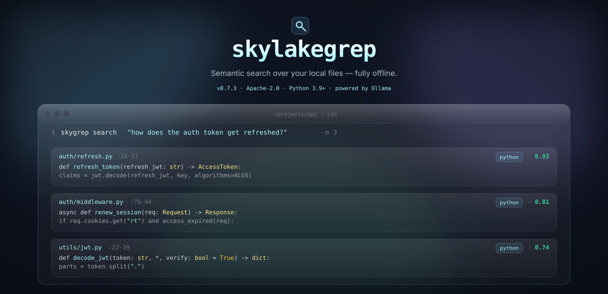

<p align="center">
  
</p>

<p align="center">
  <a href="https://pypi.org/project/skylakegrep/"></a>
  <a href="https://www.python.org/downloads/"></a>
  <a href="LICENSE"></a>
  <a href="https://danielchen26.github.io/skylakegrep/"></a>
  <a href="https://github.com/danielchen26/skylakegrep/releases/latest"></a>
</p>

<p align="center">
  <a href="#quickstart"><b>Quickstart</b></a>
  &nbsp;·&nbsp;
  <a href="#in-30-seconds"><b>30s demo</b></a>
  &nbsp;·&nbsp;
  <a href="#what-you-can-search"><b>What you can search</b></a>
  &nbsp;·&nbsp;
  <a href="#whats-new-in-02x"><b>What's new in 0.2.x</b></a>
  &nbsp;·&nbsp;
  <a href="#performance"><b>Performance</b></a>
  &nbsp;·&nbsp;
  <a href="#how-it-works"><b>How it works</b></a>
  &nbsp;·&nbsp;
  <a href="https://github.com/danielchen26/skylakegrep/releases"><b>Releases</b></a>
  &nbsp;·&nbsp;
  <a href="https://danielchen26.github.io/skylakegrep/"><b>Docs</b></a>
</p>

---

`skygrep` is a fully-offline semantic search CLI for your local files —
**code, markdown, PDFs, Word docs, plain text, anything you index**.
**Ask in plain English, get the right file and line range.** The
content-agnostic retrieval substrate (Karpathy "knowledge graph as
prior") works across content types via a pluggable extractor registry —
not a code-only tool. Indexing, retrieval, and optional answer
synthesis all run locally against your own Ollama server. No remote
service, no subscription, no data leaves your machine.

## What you can search

The retrieval substrate is **content-agnostic** by design — the
embedder (`bge-m3`, multilingual XLM-RoBERTa), the cascade, and the
reference graph all abstract over "A references B" rather than over
any specific programming language or document format. New content
types plug in via a one-line `register_extractor()` call.

| Content type | How it's parsed | Reference graph | Since |
| --- | --- | --- | :-: |
| **Code** — Rust · Python · JS · TS | tree-sitter symbol-aware chunking + line-window fallback | imports / `use` / `require` / dynamic `import()` | 0.1.0 |
| **Markdown** | line-window chunks; `[](link)`, ``, `[[wiki]]` link extraction | relative-path resolution + Obsidian-style wiki links | 0.2.0 |
| **PDF** | `pypdf` text extraction; opt-in OCR for scanned pages | — | 0.1.0 |
| **Word docs (`.docx`)** | `python-docx` paragraph extraction | — | 0.1.0 |
| **Plain text · TOML · YAML · CSV · JSON · …** | line-window chunking via the default text path | — | 0.1.0 |
| **Custom (your content type)** | register an extractor returning `(source, target)` edges | your call | 0.2.0 |

Register a new content type in one line:

```python
from skylakegrep.src.reference_graph import register_extractor

def yaml_anchor_extractor(path):
    """Return list of (source, target) reference edges."""
    ...

register_extractor("yaml", [".yaml", ".yml"], yaml_anchor_extractor)
```

## What's new in 0.2.x

| | What | Why it matters |
| --- | --- | --- |
| **Substrate** | `bge-m3` default embedder (1024-d, multilingual, symmetric, 8k context) replaces `mxbai-embed-large` | Single largest accuracy contributor — React bench 8/10 → 10/10. Existing indexes must rebuild (`--reset`). |
| **Reference graph** | `register_extractor()` registry; `code_graph.py` is a back-compat facade | Content-agnostic abstraction ("A references B"). Markdown shipped in 0.2.0. New types in one line, no retrieval-code changes. |
| **Cascade** | σ-adaptive threshold `max(τ_floor, k·σ_topK)` | Derived from cosine evidence (MacKay/Williams Bayesian framing), not a magic number. Auto-recalibrates when embedder swaps. New `tau_mode` telemetry. |
| **Path filter** | 24 universal aux-path conventions (`/fixtures/`, `/vendor/`, `/dist/`, `.development.js`, `.min.js`, …) | Structural prior, not language-specific. Applies to any corpus with similar conventions. |
| **Bench** | 30 / 30 on Django + React + Tokio public OSS bench | Was 28 / 30 in 0.1.0; latency aggregate −19 % (Tokio +57 % is the real trade-off). |
| **Symbol channel** | `multi_channel_search` with RRF k=60 fusion (internal, opt-in) | Tree-sitter symbol-as-retriever experimental primitive. Not in default CLI yet — auto-router is a 0.3.0 follow-up. |
| **Intelligent recovery (0.2.2)** | embedder upgrades auto-detected; daemon-thread re-embed in mtime-DESC priority, no `--reset` needed | Manual `skygrep index --reset` is no longer required after upgrading the embedder. Background worker re-embeds chunks in place; the user is never blocked, the existing `_filter_to_matching_dim` helper hides stale-dim chunks during recovery. Crash-safe and resumable. |
| **Routing transparency (0.2.2)** | per-query telemetry footer leads with `path=…`, σ-evidence reason, recovery state, and `quality=BEST/DEGRADED-recovery` tag | Users see which retrieval path answered every query and why. The σ-evidence line explains the cascade's choice in Bayesian terms; the recovery line shows live coverage % + ETA when a worker is active. |
| **Intelligent CLI assistance (0.2.4)** | out-of-scope query detection, typo correction for unknown flags, low-confidence result hints, first-run nudge — all gated by `SKYGREP_NO_HINTS=1` | The CLI proactively helps instead of silently shrugging. Metadata queries like *"我最近工作上的十个文件"* get a `git log` suggestion before the search runs; typoed flags get a "did you mean `--top`?" line; uncertain results get a recovery menu (`--agentic`, `--top 30`, etc.); fresh-project queries get a one-time three-line onboarding greeting. |
| **Critical recovery bug fix + hierarchical footer (0.2.5)** | `detect_mismatch` now triggers recovery on pre-0.2.2 indexes with stale-dim chunks; multi-line telemetry footer with `path` / `router` / `evidence` / `pool` / `index` / `recovery` rows + ✓/⚠ glyph; `昨天 / 今天 / 上周` now caught by out-of-scope detection (stopgap; LLM-based fix in 0.2.6) | 0.2.2-era recovery silently skipped pre-0.2.2 indexes — users could lose access to PDFs / older chunks without realising. Footer rewrite makes the routing decision and the recovery state scannable at a glance. The keyword patch is documented as a stopgap in [`docs/PRINCIPLES.md`](docs/PRINCIPLES.md) (Principle 1: Understanding over Enumeration). |
| **LLM-driven scope classification (0.2.6)** | `RouterDecision.out_of_scope` set by the same `qwen2.5:3b` call that already ran for retrieval-intent classification; `intelligent_cli.detect_out_of_scope(query, decision)` consults the LLM first, keyword list demoted to **offline fallback only** | The principled fix that 0.2.5 explicitly called a stopgap. The LLM understands new vocabulary (`我前几天写的代码`, `the last sprint's edits`) without us enumerating tokens. Zero added latency: the router LLM call already ran on every query. |
| **Proactive enhancement framework + `filename_extend` (0.2.7)** | New `skylakegrep.src.proactive` module — content-agnostic enhancer registry that runs IN PARALLEL after the cascade with a 500 ms budget; first enhancer searches `~/Downloads / ~/Desktop / ~/Documents` when the in-project filename lookup returned 0 hits | Principle 6 ("Proactive over Passive") in [`docs/PRINCIPLES.md`](docs/PRINCIPLES.md). The system no longer just shrugs when it can't find a file in the current dir — it goes looking. Normal queries pay zero extra cost (should-fire gate). Future enhancers (`query_refinement`, `markdown_link_traverse`, `pdf_section_extract`, `git_history_related`) plug in via `register_enhancer()`. |
| **Proactive bug fixes (0.2.8)** | (a) Cold-start path (index not ready) now calls the proactive enhancer hook instead of returning early — the EB1B-class case finally works as designed. (b) `filename_extend_should_fire` rewritten to trust `decision.intent` exclusively, removing a keyword-phrase fallback that was the third Principle-1 lapse in the project. (c) New firing condition: even on non-empty cascade results, fire if NONE of the basenames contain the lookup token | The user caught both regressions within hours of 0.2.7 ship. The cold-start hook means proactive actually runs on cold-start filename lookups against un-indexed dirs (the case it was designed for). The keyword-phrase removal is recorded in the [`PRINCIPLES.md`](docs/PRINCIPLES.md) receipts table with the prior three lapses. |

Full release notes: [`0.2.0`](docs/skylakegrep-0.2.0.md) · [`0.2.1`](docs/skylakegrep-0.2.1.md) · [`0.2.2`](docs/skylakegrep-0.2.2.md) · [`0.2.3`](docs/skylakegrep-0.2.3.md) · [`0.2.4`](docs/skylakegrep-0.2.4.md) · [`0.2.5`](docs/skylakegrep-0.2.5.md) · [`0.2.6`](docs/skylakegrep-0.2.6.md) · [`0.2.7`](docs/skylakegrep-0.2.7.md) · [`0.2.8`](docs/skylakegrep-0.2.8.md)

**Project principles** (architecture rules contributors should
follow): [`docs/PRINCIPLES.md`](docs/PRINCIPLES.md) — substrate
over enumeration, latency / quality / correctness ordering,
release-discipline, honest evaluation. The receipts table at the
top documents past lapses (`code_graph.py` regex / `mxbai-embed-large`
substrate / `symbol_channel.py` tree-sitter / `_METADATA_TOKENS`
keyword) and how each was or will be replaced with a substrate /
registry / LLM-driven generic path.

## In 30 seconds

```console
$ pip install skylakegrep
$ ollama pull bge-m3 qwen2.5:1.5b qwen2.5:3b   # one-time
$ cd ~/your-project

$ skygrep "where is the cascade tau threshold defined?"
=== skylakegrep/src/storage.py:578-602 (score: 0.781) ===
CASCADE_DEFAULT_TAU = 0.015

def cascade_search(...
[0.42s · path=cosine-cheap · router=llm · intent=mixed (0.83) · 1 filename + 0 lexical · σ-gap=0.0820 ≥ τ=0.0050 (adaptive) → high-confidence early-exit · index 20s ago · 36 files · L2 symbols on · graph prior on · quality=BEST]
```

That is the entire happy path. **First query in a fresh project completes
in under 1 s** via a ripgrep fallback while a background process builds
the semantic index. Every query after that uses the full cascade with a
local LLM kept warm in memory.

## Quickstart

```bash
pip install skylakegrep
ollama pull nomic-embed-text qwen2.5:1.5b qwen2.5:3b   # ~3 GB total

# One-time: register skylakegrep with detected LLM CLIs
# (Claude Code / Codex / OpenCode / Gemini CLI / Cursor)
skygrep setup

cd /your/project
skygrep "<your question>"
skygrep doctor                # verify runtime + models + index + integrations
skygrep stats                 # show current project's index info
```

`skygrep` derives the project root from `git rev-parse --show-toplevel`
(falling back to the working directory) and keeps a per-project index
under `~/.skylakegrep/repos/`. Subcommand names (`index`, `doctor`,
`stats`, `watch`, `serve`, `setup`, `enrich`) take precedence — anything
else is treated as a query, so `skygrep "stats and metrics"` (quoted) is
unambiguous.

**`skygrep setup`** writes a small markdown snippet to each detected LLM
CLI's user-level instructions file (e.g. `~/.claude/CLAUDE.md`,
`~/.codex/AGENTS.md`, `~/.gemini/GEMINI.md`) telling the agent to
prefer `skygrep` for natural-language search across local files and fall back to `rg`
otherwise. Snippets are delimited by markers; `skygrep setup --uninstall`
removes them cleanly without touching your other instructions.

## Performance

Public, reproducible benchmark on three popular open-source codebases.
30 hand-labelled questions total (10 per repo). Anyone can clone the
repos and re-run with one command — see
[`benchmarks/public_oss_bench.py`](benchmarks/public_oss_bench.py)
and [`docs/parity-benchmarks.md`](docs/parity-benchmarks.md).

| Repo | Language | LOC ≈ | Tasks | skygrep recall | rg recall | Token reduction |
| --- | --- | :-: | :-: | :-: | :-: | :-: |
| **Django** | Python | 524 K | 10 | **10 / 10** | 10 / 10 | **703 ×** |
| **Tokio** | Rust | 80 K | 10 | **10 / 10** | 10 / 10 | 61 × |
| **React** | JS+TS | 270 K | 10 | **10 / 10** | 10 / 10 | **773 ×** |
| **Aggregate** | | | **30** | **30 / 30 (100 %)** | 30 / 30 | **60×–770×** |

Honest reading:

  - **Hit-rate parity across all three** (10/10 each on Django,
    Tokio, React). The two React misses that previously surfaced
    (test-fixture path bias on `react-007`, devtools-vs-reconciler
    on `react-010`) were resolved by upgrading the embedding
    substrate to `bge-m3` and extending the non-canonical-path
    filter — see
    [`docs/parity-benchmarks.md`](docs/parity-benchmarks.md) for the
    failure analysis and the resolution.
  - **`rg` "100 %" is a recall-ceiling baseline.** It returns
    20 M+ tokens per task (term-OR scan with 2-line context windows).
    Yes the answer is in the dump; no, the agent has to read the
    20 M tokens to find it.
  - **skygrep delivers the answer ranked top-10 in 30 / 30 cases**
    while emitting **60×–770× less context** for the agent's LLM
    round-trip downstream. That is the user-facing claim.

Recall counts a query as a hit when at least one returned chunk
matches the canonical `expected` path or any of the question's
`expected_alternatives`.

### Cascade-only ablation (Django, in-bench numbers)

| Tier | What it does | Cold first query | Warm avg s/q |
| --- | --- | :-: | :-: |
| **cascade** ⭐ default | rg prefilter → file-mean cosine → escalate to HyDE only when uncertain | ~10 s (Ollama loads) | **0.5–2 s** (warm) |
| cascade-cheap | early-exit only, no LLM call | <1 s | <0.2 s |
| cascade + small HyDE (`OLLAMA_HYDE_MODEL=qwen2.5:1.5b`) | uses 1.5 B for HyDE — faster, slightly lower recall | ~5 s | **2.0 s** |
| chunk + rerank | classic chunk cosine + cross-encoder rerank | ~10 s + 30 s reranker load | ~10 s |
| ripgrep raw | `rg -il -F` token-OR (file membership only) | <1 s | <1 s |

The cascade is bimodal by design: ~80 % of queries take the cheap path
(file-mean cosine, no LLM call) and complete in under 200 ms warm; the
remaining ~20 % escalate to a HyDE-augmented retrieval and complete in
the 1–2 s band. With Ollama models kept resident in memory
(`OLLAMA_KEEP_ALIVE=-1`, the 0.6.0 default) the second query in a shell
session no longer pays the 5–10 s Ollama cold-load.

A second [self-test benchmark](docs/token-benchmarking.md) compares
`skygrep` against a simulated grep agent over 30 navigation tasks against
this repo: 30 / 30 recall at top-k 10 with **2× total-token reduction**
and **2.9× context-token reduction** vs the agent baseline.

## How it works

```
your query
    │
    ▼
┌─────────────────────────────────────────────────────────────────┐
│ 1.  ripgrep prefilter      Fast surface-token narrowing          │
│ 2.  file-mean cosine       Rank files by mean of chunk vectors   │
│ 3.  cascade decision       Confident? return cheap. Else escalate│
│ 4.  HyDE escalation        LLM rewrites query → cosine union     │
│ 5.  symbol + graph         Tree-sitter symbol boost + PageRank   │
│     (L2 + L4)              tiebreaker on near-tied candidates    │
└─────────────────────────────────────────────────────────────────┘
    │
    ▼
top-K chunks (path · line range · score · snippet)
```

Each layer is **offline-paid and query-time-free where possible**:
embeddings are precomputed at index time, symbol extraction runs once
per project, the file-export PageRank is one regex pass over the corpus.
Only the cascade's HyDE-escalation path makes a query-time LLM call, and
it only runs on the ~20 % of queries the cheap path is uncertain about.

The full architecture diagram and module-by-module walk-through is at
[`docs/skylakegrep-0.1.0.md`](docs/skylakegrep-0.1.0.md) and
[`docs/roadmap.md`](docs/roadmap.md).

## Command cheatsheet

The **bare form** covers ~95 % of real-world use:
`skygrep "<your question>"`. No subcommand, no flags. The system
auto-routes (LLM router → `find` / `rg` / semantic cascade),
auto-indexes on first query, and auto-recovers when the embedder
is upgraded (0.2.2+). The subcommand form below is for power use,
admin, and CI.

| Command | When to use | Example |
| --- | --- | --- |
| **`skygrep "<query>"`** *(bare)* | Default. Just ask a question. Auto-indexes, auto-recovers. | `skygrep "where is the auth refresh logic"` |
| `skygrep search <query>` | Explicit form when you need flags. | `skygrep search "session token" --top 20 --json` |
| `skygrep doctor` | First-time troubleshooting. Probes Ollama, lists models, summarises the project index, checks LLM-CLI integrations. | `skygrep doctor` |
| `skygrep setup` | Register skygrep with detected LLM CLIs (Claude Code, Codex, OpenCode, Gemini CLI, Cursor) so agents prefer it. Run once. | `skygrep setup` · `skygrep setup --uninstall` |
| `skygrep stats` | Print chunk and file counts for the current project's index. | `skygrep stats` |
| `skygrep index [PATH] [--reset]` | **Rarely needed.** First query auto-indexes; the 0.2.2 recovery worker handles embedder upgrades. Use `--reset` only when you actively want a clean rebuild. | `skygrep index .` · `skygrep index . --reset` |
| `skygrep watch [PATH] -i N` | Keep the index live in the background. Polls `PATH` every `N` seconds (default 5). | `skygrep watch .` |
| `skygrep serve --port P` | Daemon mode. Keeps cross-encoder + Ollama warm in memory; warm queries land in 0.5–2 s. | `skygrep serve --port 7878` |
| `skygrep enrich` | Advanced. Generate doc2query-style descriptions for each chunk (improves vocab-mismatch retrieval at index-time cost). | `skygrep enrich` |

### When to add what flag

| You want | Use |
| --- | --- |
| Find code by concept ("how does X work?") | `skygrep "<query>"` |
| Find code with a known literal token | `rg <token>` (faster, no setup) — or just `skygrep "<query>"`, the auto-router will short-circuit to `rg` internally |
| Synthesize an answer with citations | `skygrep "<query>" --answer` |
| Decompose a broad question | `skygrep "<query>" --agentic --max-subqueries 3 --answer` |
| Machine-readable output for an agent | `skygrep "<query>" --json` |
| Re-rank candidates with a cross-encoder explicitly | `skygrep "<query>" --no-cascade --rerank` |
| Continuously index a watched dir | `skygrep watch /path` |
| Keep the cross-encoder warm across queries | `skygrep serve &; skygrep "<q>" --daemon-url http://127.0.0.1:7878` |

### Reading the per-query telemetry footer (0.2.2+)

Every search prints a one-line footer so you can see *which*
retrieval path answered your query and *why*:

```
[0.42s · path=cosine-cheap · router=llm · intent=mixed (0.83)
       · 1 filename + 0 lexical
       · σ-gap=0.0820 ≥ τ=0.0050 (adaptive) → high-confidence early-exit
       · index 20s ago · 36 files · L2 symbols on · graph prior on
       · quality=BEST]
```

  - **`path=`** — `cosine-cheap` / `cosine-escalated-rerank` / `rg-only` / `cascade-skipped`. The retrieval strategy this specific query took.
  - **`σ-gap=… → reason`** — Bayesian-evidence proxy that drove the cascade decision. High σ-gap = top-K candidates well-separated → cosine trusted, exit cheap. Low σ-gap = candidates tied → escalate to rerank.
  - **`recovery=in-progress chunks=N/T coverage=N% ETA=Nm`** — only when the 0.2.2 recovery worker is active. Reads live from the metadata table.
  - **`quality=BEST` / `quality=DEGRADED-recovery`** — at-a-glance "is this the full-quality semantic answer". `DEGRADED` only means some files are still pending re-embed; your specific query may be unaffected.

## Configuration

| Variable | Default | Effect |
| --- | --- | --- |
| `OLLAMA_URL` | `http://localhost:11434` | Ollama server URL. |
| `OLLAMA_EMBED_MODEL` | `bge-m3` | Embedding model. Switching is **auto-detected and recovered in the background** (0.2.2+) — no manual `--reset` needed any more. |
| `OLLAMA_LLM_MODEL` | `qwen2.5:3b` | Used for `--answer` and `--agentic`. |
| `OLLAMA_HYDE_MODEL` | `qwen2.5:3b` | Used for cascade-escalation HyDE. Falls back to `OLLAMA_LLM_MODEL` if not installed. Set to `qwen2.5:1.5b` for ~30 % speedup at the cost of 1 task on 16-task Rust. |
| `OLLAMA_KEEP_ALIVE` | `-1` | Passed to every Ollama call. `-1` keeps models resident indefinitely (recommended). |
| `SKYGREP_DB_PATH` | per-project | When set, skygrep treats the index as curated and disables auto-mutation. |
| `SKYGREP_AUTO_PULL` | unset | Set `yes` to auto-`ollama pull` missing models without prompting. |
| `SKYGREP_AUTO_REFRESH_THROTTLE_SECONDS` | `30` | Skip the mtime scan if the previous refresh ran more recently. |
| `SKYGREP_RERANK_MODEL` | `mixedbread-ai/mxbai-rerank-large-v2` | Cross-encoder for `--rerank`. |
| `SKYGREP_RERANK_POOL` | `50` | Candidate pool before reranking. |

## Releases

This is the first public release of `skylakegrep`. See
[`docs/skylakegrep-0.1.0.md`](docs/skylakegrep-0.1.0.md) for the full
description of capabilities, architecture, CLI flags, and
environment variables.

  - **0.1.0** — first public release. LLM-driven query routing
    (filename / lexical / semantic cascade tiers, intent-aware
    merge), confidence-gated semantic cascade with HyDE escalation +
    cross-encoder rerank + PageRank tiebreaker, lazy PDF / docx
    content extraction (`pdftotext` + `pypdf` fallback, optional
    `--ocr`), framed Pygments-highlighted card rendering, four
    `--detail` levels, `skygrep setup` auto-registration with major
    LLM CLIs (Claude Code, Codex, OpenCode, Gemini CLI, Cursor).
    PolyForm Noncommercial 1.0.0 license.

## CLI reference

```
skygrep setup    [--list|--uninstall|--yes] # register with Claude Code / Codex / OpenCode / Gemini / Cursor
skygrep "<query>" [OPTIONS]                 # bare-form search
skygrep search   "<query>" [OPTIONS]        # explicit search
skygrep doctor                              # health check
skygrep stats                               # project index info
skygrep index    [PATH] [--reset]           # explicit reindex
skygrep watch    [PATH] --interval N        # poll for changes
skygrep serve    [--host H] [--port P]      # warm-reranker daemon
skygrep enrich   [--max N] [--batch B]      # opt-in doc2query enrichment
```

<details>
<summary><b><code>skygrep search</code> options</b></summary>

<br>

| Option | Default | Effect |
| --- | --- | --- |
| `-m`, `-n`, `--top` | 5 | Number of final results. |
| `--json` | off | Emit a JSON array; suppresses human formatting. |
| `--answer` | off | Synthesize an answer from retrieved snippets via Ollama. |
| `--content / --no-content` | on | Show or hide snippet bodies in human output. |
| `--language` | — | Restrict to one or more language keys; repeatable. |
| `--include` / `--exclude` | — | Glob filter (repeatable). |
| `--cascade / --no-cascade` | on | Confidence-gated retrieval. Off = chunk-only legacy path. |
| `--cascade-tau` | 0.015 | Top-1 / top-2 file-mean cosine gap above which to early-exit. |
| `--rerank / --no-rerank` | on | Cross-encoder rerank on the non-cascade path. |
| `--rerank-pool` | 50 | Candidate pool before reranking. |
| `--rerank-model` | env or default | HuggingFace cross-encoder id. |
| `--hyde / --no-hyde` | off | Force HyDE outside the cascade (rare; cascade decides per query). |
| `--multi-resolution / --no-multi-resolution` | on | File-level cosine top-N → chunk-level inside those files. |
| `--file-top` | 30 | Files surfaced by file-level retrieval. |
| `--lexical-prefilter / --no-lexical-prefilter` | on | Use ripgrep to narrow the candidate file set. |
| `--lexical-root` | cwd / git toplevel | Root directory ripgrep scans. |
| `--lexical-min-candidates` | 2 | Fall back to corpus-wide cosine when ripgrep returns fewer files. |
| `--rank-by` | `chunk` | `chunk` (per-file diversity cap) or `file` (one chunk per file). |
| `--auto-index / --no-auto-index` | on | Auto-build the index on first query and refresh on mtime change. |
| `--daemon-url` | — | Send the search to a running `skygrep serve` daemon. |
| `--agentic` | off | Decompose into subqueries via Ollama before search. |
| `--max-subqueries` | 3 | Upper bound on agentic subqueries. |
| `--semantic-only` | off | Skip lexical reranking; rank by cosine alone. |

</details>

<details>
<summary><b>Capability matrix (every feature, when introduced)</b></summary>

<br>

| Capability | Since |
| --- | --- |
| Semantic file search via local Ollama (code + docs + PDFs) | 0.1.0 |
| `bge-m3` multilingual substrate as default embedder | 0.2.0 |
| Content-agnostic reference-graph registry (`register_extractor()`) | 0.2.0 |
| Built-in markdown link extractor (`[](link)`, ``, `[[wiki]]`) | 0.2.0 |
| σ-adaptive cascade threshold (`max(τ_floor, k·σ_topK)`) | 0.2.0 |
| Universal non-canonical-path filter (24 patterns: fixtures/vendor/dist/.min.js/…) | 0.2.0 |
| Symbol-as-retriever channel (internal, opt-in) | 0.2.0 |
| Public-OSS bench: 30 / 30 (Django · React · Tokio) | 0.2.0 |
| Intelligent background recovery (auto re-embed on embedder upgrade) | 0.2.2 |
| Routing-transparency telemetry (`path=…`, σ-evidence reason, `quality=BEST/DEGRADED-recovery`) | 0.2.2 |
| Comprehensive command cheatsheet on README + GitHub Pages | 0.2.3 |
| Per-release docs sync discipline ([`docs/RELEASING.md`](docs/RELEASING.md)) | 0.2.3 |
| Out-of-scope query detection (metadata queries → suggest `git log` / `find`) | 0.2.4 |
| Typo correction for unknown flags (`--tup` → "Did you mean `--top`?") | 0.2.4 |
| Low-confidence result hints (top-1 score + σ-gap floor) | 0.2.4 |
| First-run nudge (one-time onboarding greeting per project) | 0.2.4 |
| `SKYGREP_NO_HINTS=1` to silence all intelligent-CLI hints | 0.2.4 |
| Recovery worker triggers on pre-0.2.2 indexes (fingerprint-unset + stale chunks) | 0.2.5 |
| Hierarchical multi-line telemetry footer with ✓/⚠ glyph + category rows | 0.2.5 |
| `SKYGREP_FOOTER_COMPACT=1` to keep the legacy single-line footer | 0.2.5 |
| Day-relative recency tokens caught (`昨天 / 今天 / 上周 / yesterday / this week`) | 0.2.5 |
| Project principles document ([`docs/PRINCIPLES.md`](docs/PRINCIPLES.md)) | 0.2.5 |
| LLM-driven scope classification (`RouterDecision.out_of_scope`) — primary | 0.2.6 |
| Keyword `_METADATA_TOKENS` demoted to offline-only fallback | 0.2.6 |
| Router cache forward/backward compat (filter unknown keys on read) | 0.2.6 |
| Proactive enhancement framework (`proactive.register_enhancer()`) | 0.2.7 |
| Built-in `filename_extend` enhancer (parallel `find` across home dirs) | 0.2.7 |
| `SKYGREP_PROACTIVE_BUDGET_MS` (default 500) and `SKYGREP_NO_PROACTIVE=1` env vars | 0.2.7 |
| Principle 6 — Proactive over Passive (in [`docs/PRINCIPLES.md`](docs/PRINCIPLES.md)) | 0.2.7 |
| Tree-sitter chunking + line-window fallback | 0.2.0 |
| `.gitignore` / `.skygrepignore` hygiene | 0.2.0 |
| Incremental indexing (mtime-based) | 0.2.0 |
| Stale row cleanup | 0.2.0 |
| Watch mode | 0.2.0 |
| Hybrid lexical + semantic ranking | 0.2.0 |
| Stable JSON output | 0.2.0 |
| Local answer mode | 0.2.0 |
| Local agentic decomposition | 0.2.0 |
| Cross-encoder rerank | 0.3.0 |
| Asymmetric query/document embedding prefixes | 0.3.0 |
| HyDE query rewriting | 0.3.0 |
| Multi-resolution retrieval | 0.3.0 |
| Lexical prefilter (ripgrep first stage) | 0.3.0 |
| File-rank (one chunk per file) | 0.3.0 |
| Daemon mode | 0.3.0 |
| Quantisation / device knobs | 0.3.0 |
| Confidence-gated cascade | 0.3.0 (default in 0.4.0) |
| Bare-form invocation `skygrep "<q>"` | 0.4.0 |
| Per-project auto-index | 0.4.0 |
| `skygrep doctor` health check | 0.4.0 |
| Ripgrep fallback for first query | 0.4.1 |
| Symbol-aware indexing (L2) | 0.5.0 |
| doc2query enrichment (L3, opt-in via `skygrep enrich`) | 0.5.0 |
| File-export PageRank tiebreaker (L4) | 0.5.0 |
| Cascade file-mean cosine corpus-wide | 0.5.1 |
| Smaller default HyDE model + `keep_alive=-1` | 0.6.0 |

</details>

## Development

```bash
git clone https://github.com/danielchen26/skylakegrep.git
cd skylakegrep
python3 -m venv .venv
source .venv/bin/activate
pip install -e ".[rerank]"

.venv/bin/pytest -q tests/
.venv/bin/python benchmarks/agent_context_benchmark.py --top-k 10 --summary-only
```

To reproduce the public OSS benchmark numbers, follow the instructions
in [`docs/parity-benchmarks.md`](docs/parity-benchmarks.md).

## License

**PolyForm Noncommercial 1.0.0** — see [`LICENSE`](LICENSE).

Personal, academic, research, hobby, and any other non-commercial
use is fully permitted, including modification and redistribution.
**Commercial use is NOT permitted** under this license. To obtain
a commercial license, open a GitHub issue titled "Commercial
license inquiry" or email <chentianchi@gmail.com>.

## Acknowledgments

- [Ollama](https://ollama.com/) for the local embedding and generation runtime.
- [tree-sitter](https://tree-sitter.github.io/tree-sitter/) for syntax-aware parsing.
- [ripgrep](https://github.com/BurntSushi/ripgrep) for the lexical prefilter stage.
- [Mixedbread](https://www.mixedbread.com/) for the open-source `mxbai-rerank-*-v2` cross-encoder family.
- [nomic-embed-text](https://www.nomic.ai/blog/posts/nomic-embed-text-v1) for the embedding model.
- Click, NumPy, and SQLite for the core runtime dependencies.
