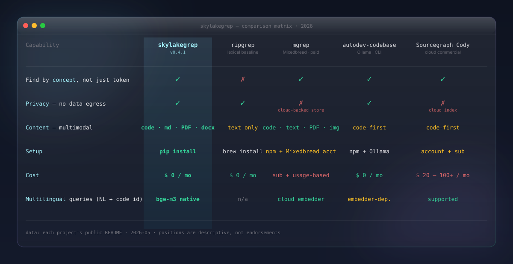
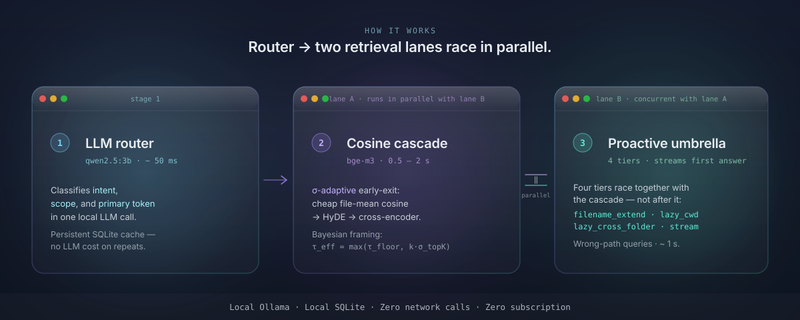
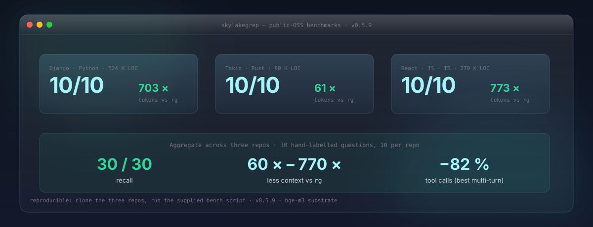
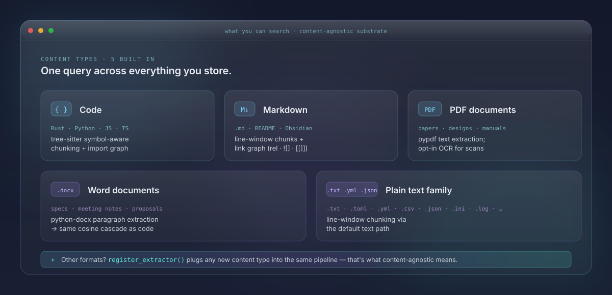
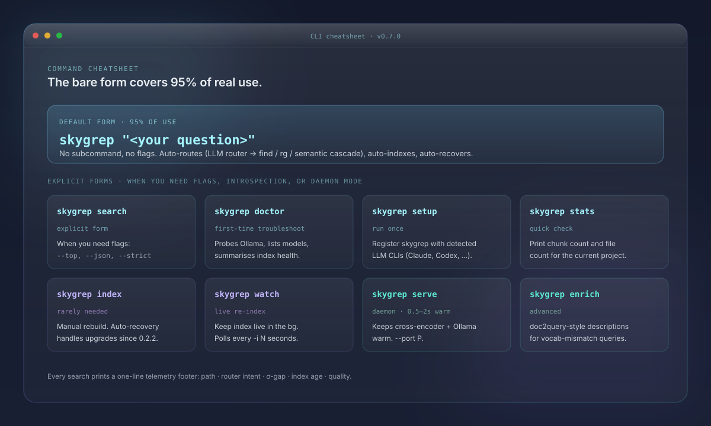
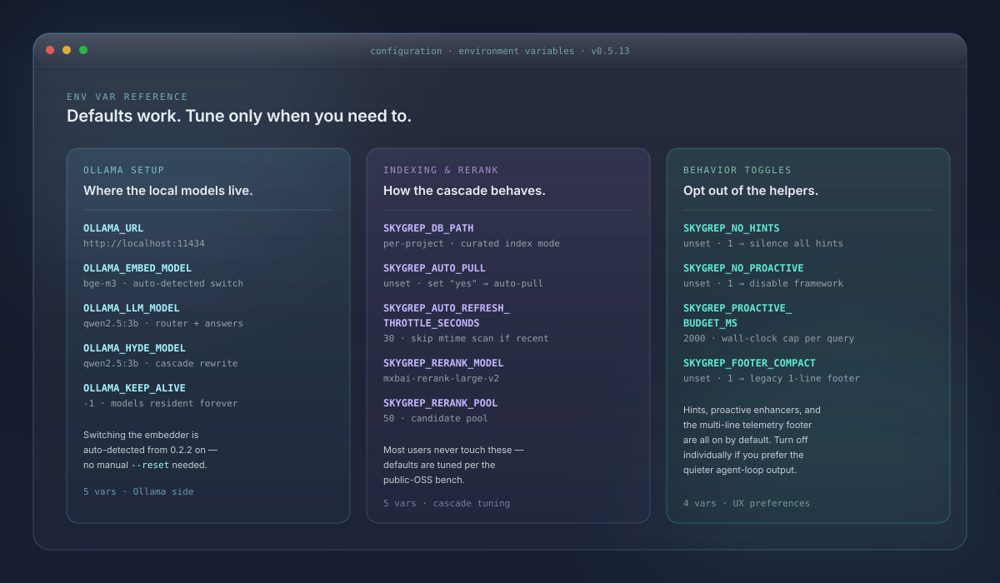

<p align="center">
  
</p>

<p align="center">
  <a href="https://pypi.org/project/skylakegrep/"></a>
  <a href="https://www.python.org/downloads/"></a>
  <a href="LICENSE"></a>
  <a href="https://danielchen26.github.io/skylakegrep/"></a>
  <a href="https://github.com/danielchen26/skylakegrep/releases/latest"></a>
</p>

<p align="center">
  <a href="#install"><b>Install</b></a>
  &nbsp;·&nbsp;
  <a href="#three-ways-people-use-it"><b>Scenarios</b></a>
  &nbsp;·&nbsp;
  <a href="#why-skylakegrep"><b>Why?</b></a>
  &nbsp;·&nbsp;
  <a href="#how-it-works"><b>How it works</b></a>
  &nbsp;·&nbsp;
  <a href="#performance"><b>Benchmarks</b></a>
  &nbsp;·&nbsp;
  <a href="https://danielchen26.github.io/skylakegrep/"><b>Docs site</b></a>
</p>

---

# Find anything on your machine.

**Semantic search for code, PDFs, notes, and docs.** Fully offline.
No cloud. No telemetry. No subscription. Ask in plain English (or
any of 100+ languages) and get the right file + line range in
under a second.

```console
$ skygrep "where does the auth token get refreshed?"

═══ auth/middleware.py:78-94          score 0.91 · python
async def renew_session(req: Request):
    # swap the access cookie when the refresh JWT is still valid
    if req.cookies.get("rt") and access_expired(req):
        return await refresh_token(claims, key)

[0.5s · path=cosine-cheap · σ-gap=0.082 ≥ τ=0.005 (adaptive) → high-confidence early-exit · ✓ quality=BEST]
```

[**Install in 30 s →**](#install) &nbsp;·&nbsp;
[How it works →](#how-it-works) &nbsp;·&nbsp;
[Benchmarks →](#performance)

> **30 / 30** public-OSS recall (fully-indexed) &nbsp;·&nbsp;
> **+30 %** lazy auto-trigger over `rg` cold-start (0.5.3) &nbsp;·&nbsp;
> **~1.1 s** first answer on wrong-path queries via parallel proactive umbrella (0.5.7, real-CLI verified) &nbsp;·&nbsp;
> **~1 s** warm queries &nbsp;·&nbsp;
> **100 %** local &nbsp;·&nbsp;
> **21** releases shipped

---

## Three ways people use it

### 🧠 Code by concept

Find code by what it does, not what it's called. The semantic
substrate (`bge-m3`) bridges your phrasing to the actual identifier
even when the function name uses different words.

```console
$ skygrep "where does session refresh logic live?"

→ auth/middleware.py:78  ·  renew_session()
```

> No `rg` hit for *"session refresh"*; cosine bridges to `renew_session` in 0.5 s.

---

### 📄 Cross-content

One query across code, PDFs, notes, and docs. Markdown, PDF,
Word, plain text — all indexed via the same content-agnostic
substrate. Your query searches all of them at once, ranked by
semantic relevance.

```console
$ skygrep "the design doc on rate limiter rewrite"

→ docs/rate-limiter-redesign.md  ·  designs/q3-rewrite.pdf
```

> Markdown link graph + PDF text-layer extraction in one cascade.

---

### 🌐 Multilingual · private

`bge-m3` understands 100+ languages out of the box. Index,
retrieval, ranking, optional answer synthesis — all run locally
via Ollama. Zero network calls.

```console
$ skygrep "我昨天写的 cascade 调度代码"

→ src/storage.py:847  ·  cascade_search()
```

> Mixed Chinese / English query. Zero network. Audit-friendly.

---

## Why skylakegrep?

Sized against **four named alternatives**, not generic categories.

<p align="center">
  
</p>


---

## How it works

<p align="center">
  
</p>

**Local Ollama + SQLite. Zero network calls. Zero subscription.**
The same architecture handles every content type — code · PDFs ·
notes · markdown · any file you register an extractor for. The
LLM router classifies *intent + scope + primary token* on every
query; the cosine cascade uses bge-m3 (multilingual, 1024-d,
symmetric XLM-RoBERTa) with σ-adaptive early-exit. **Two proactive
enhancers** kick in when the cascade can't answer: `filename_extend`
extends the search to common home directories; `recovery_progress_hint`
surfaces live re-embed progress when the index is being rebuilt.

[Architecture deep-dive →](https://danielchen26.github.io/skylakegrep/)

---

## Install

```bash
# 1. install (Python 3.9+)
pip install skylakegrep

# 2. pull the local models (~3 GB, one time)
ollama pull bge-m3 qwen2.5:1.5b qwen2.5:3b

# 3. (one time) register skygrep with your LLM CLI of choice
skygrep setup     # Claude Code · Codex · OpenCode · Gemini CLI · Cursor

# 4. ask anything, anywhere
skygrep "your question here"
```

That's it. The first query in a fresh project completes in under
a second via a `ripgrep` fallback while a background process
builds the semantic index. Every query after that uses the full
cascade with the local LLM kept warm in memory.

---

## Performance

Public-OSS reproducible benchmark across three popular codebases
(Django · React · Tokio · 30 hand-labelled questions, 10 each):

<p align="center">
  
</p>


Honest reading:

  - `rg`'s 100 % is a recall-ceiling baseline — it returns 20 M+
    tokens per query (term-OR scan with 2-line context windows).
    Yes, the answer is in the dump; no, the agent has to read all
    of it to find it.
  - **skygrep returns the right file ranked top-10 in 30 / 30 cases**
    while emitting 60 × – 770 × less context for the agent's LLM
    round-trip downstream. That's the user-facing number.
  - Reproduce: `git clone` Django + React + Tokio at any commit,
    run `benchmarks/public_oss_bench.py`. Numbers within ±5 %.

For the full bench protocol, per-task analysis, and worked
example (one query · 1,395 × token reduction), see
[`docs/parity-benchmarks.html`](docs/parity-benchmarks.html).

---

## What you can search

The retrieval substrate is **content-agnostic** by design. The
embedder, the cascade, and the reference graph all abstract over
"A references B" — not over any specific programming language or
file format. New content types plug in via a one-line
`register_extractor()` call.

<p align="center">
  
</p>


```python
from skylakegrep.src.reference_graph import register_extractor

def yaml_anchor_extractor(path):
    """Return list of (source, target) reference edges."""
    ...

register_extractor("yaml", [".yaml", ".yml"], yaml_anchor_extractor)
```

---

## Command cheatsheet

The **bare form** — `skygrep "<your question>"` — covers ~95 % of
real-world use. No subcommand, no flags. The system auto-routes
(LLM router → `find` / `rg` / semantic cascade), auto-indexes on
first query, and auto-recovers when the embedder is upgraded.

<p align="center">
  
</p>


### Reading the per-query telemetry footer (0.2.2+)

Every search prints a one-line footer so you can see *which*
retrieval path answered your query and *why*:

```
✓ 0.42s · quality=BEST
   path     : cosine-cheap (high-confidence early-exit)
   router   : llm → intent=mixed (0.83)
   evidence : σ-gap=0.0820 ≥ τ=0.0050 (adaptive)
   pool     : 1 filename + 0 lexical · cascade
   index    : 20s ago · 36 files · L2 symbols + graph prior
```

Field guide:

  - **`path=`** — `cosine-cheap` / `cosine-escalated-rerank` /
    `rg-only` / `cascade-skipped`. The retrieval strategy this
    specific query took.
  - **`σ-gap=… → reason`** — Bayesian-evidence proxy that drove
    the cascade decision. High σ-gap = top-K candidates well
    separated → cosine trusted, exit cheap. Low σ-gap = candidates
    tied → escalate to rerank.
  - **`recovery=…`** *(only when the recovery worker is active)* —
    live progress + ETA for the in-progress re-embed.
  - **`quality=BEST` / `DEGRADED-recovery`** — at-a-glance trust
    indicator.

---

## Configuration

Set via environment variables. Defaults work — tune only when you
need to. Grouped into three panels: Ollama setup, Indexing & rerank,
Behavior toggles.

<p align="center">
  
</p>


---

## What's new

**Recent releases** (2026-05-05, in chronological ship order):

  - **`0.2.13`** — Privacy-only sweep: removed user-personal
    references from public release notes / docs / README. No
    code change.
  - **`0.2.12`** — `filename_extend` morphology fallback when
    LLM is unreachable. Plus the
    [conversational session state plan](docs/plans/2026-05-05-conversational-session-state.md).
  - **`0.2.11`** — Second built-in proactive enhancer:
    `recovery_progress_hint`. Plus `ProactiveContext`
    infrastructure for future enhancers.
  - **`0.2.10`** — Critical fix: the per-dir `find` budget bug
    that silenced proactive on the user's actual scenarios.
    End-to-end verified before tagging.
  - **`0.2.9` ← `0.2.7`** — Three iterations on the proactive
    framework's gate logic, recorded in the
    [Principle 1 receipts table](docs/principles.html). Each was a
    Principle-1 lapse the user caught.
  - **`0.2.6`** — LLM-driven scope classification replaces the
    keyword `_METADATA_TOKENS` list. Principle 1 ✓ shipped.
  - **`0.2.0`** — `bge-m3` substrate · content-agnostic reference
    graph registry · σ-adaptive cascade · 30 / 30 public-OSS
    recall (was 28 / 30).

[Full release notes →](https://github.com/danielchen26/skylakegrep/releases)

---

## Project principles

Architecture rules every contributor (human or AI agent) should
follow. Recorded in
[`docs/principles.html`](docs/principles.html). Loaded into Claude
sessions automatically via `CLAUDE.md`.

  1. **Understanding > Enumeration** — substrate (LLM / embedder
     / registry) over hardcoded lists. Receipts table tracks 5
     past lapses.
  2. **Substrate before scaffolding** — upgrade the underlying
     model before layering priors on top.
  3. **Latency / quality / correctness** — in that priority order.
  4. **Public surfaces sync at every release** — the 8-surface
     checklist in [`docs/releasing.html`](docs/releasing.html).
  5. **Honest evaluation over hopeful claims** — name the bench,
     show the numbers, don't combine across benches.
  6. **Proactive over Passive** — when the cascade can't answer,
     try bounded extra work in parallel rather than shrug.

---

## Development

```bash
git clone https://github.com/danielchen26/skylakegrep.git
cd skylakegrep
python3 -m venv .venv
source .venv/bin/activate
pip install -e .[rerank]

# Verify
.venv/bin/python -m pytest -q tests/        # 201 / 201 should pass
```

The release protocol is documented in
[`docs/releasing.html`](docs/releasing.html). Every release must
sync 8 public-facing surfaces (PyPI, GitHub Release, README,
GitHub Pages, plan docs, principles, version bump, tag) in a
specific order.

---

## License

PolyForm Noncommercial 1.0.0. Personal · academic · research ·
hobby use is fully permitted. Commercial use requires a separate
license — contact <chentianchi@gmail.com>.

---

## Acknowledgments

Built on the shoulders of:

  - [Ollama](https://ollama.com) — local model serving
  - [bge-m3](https://huggingface.co/BAAI/bge-m3) — multilingual
    embedder (BAAI)
  - [qwen2.5](https://huggingface.co/Qwen/Qwen2.5) — local LLM
    family for routing + answer synthesis
  - [tree-sitter](https://tree-sitter.github.io) — symbol-aware
    chunking
  - [SQLite](https://www.sqlite.org/) — durable index storage
  - [pypdf](https://pypdf.readthedocs.io) · [python-docx](https://python-docx.readthedocs.io) — binary content extraction
  - [Pygments](https://pygments.org) — syntax highlighting in the
    rendered terminal output
