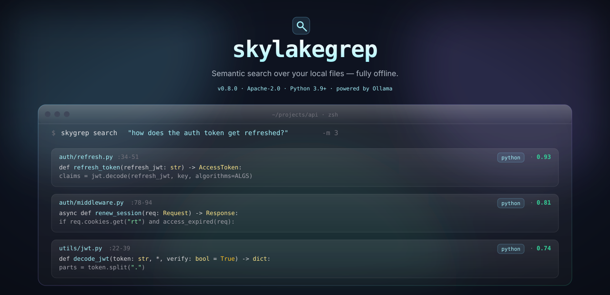
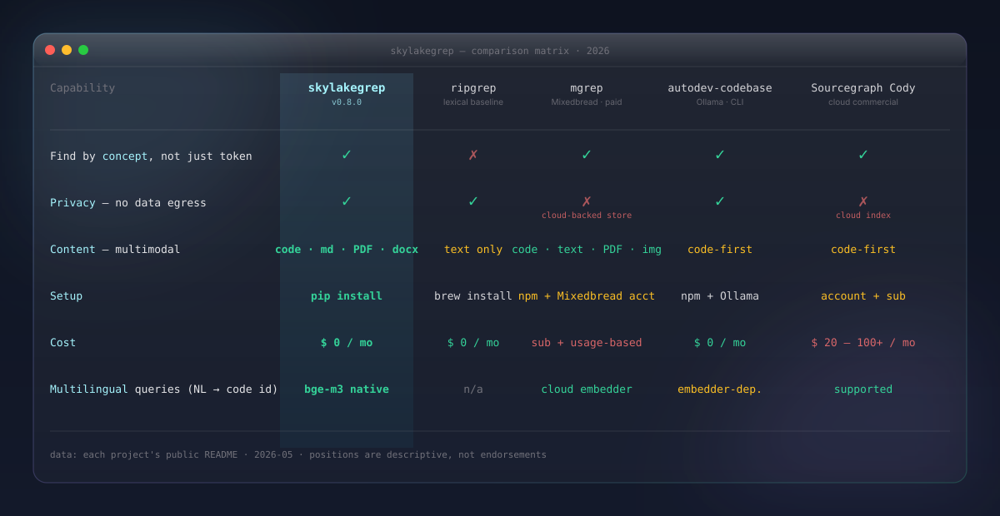
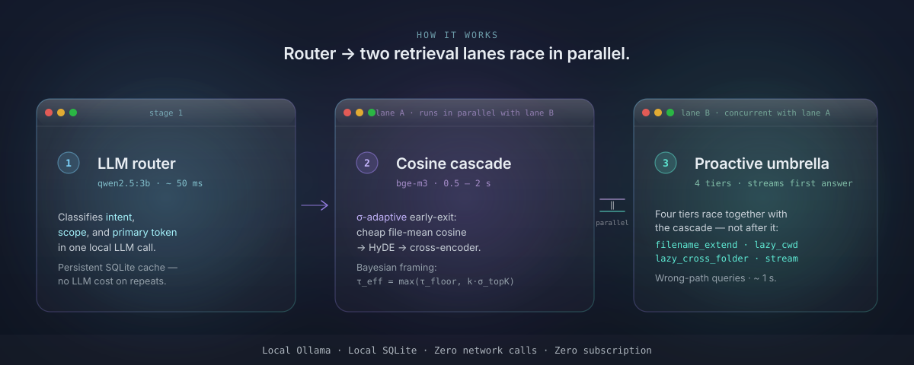
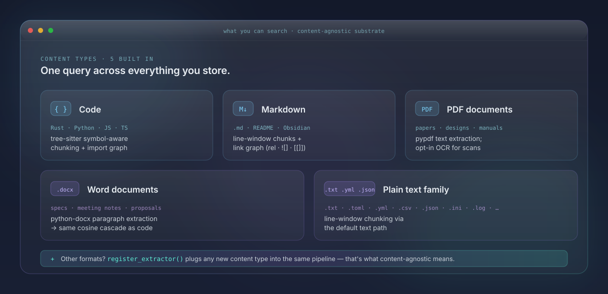
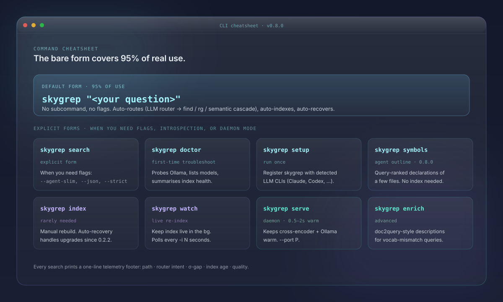
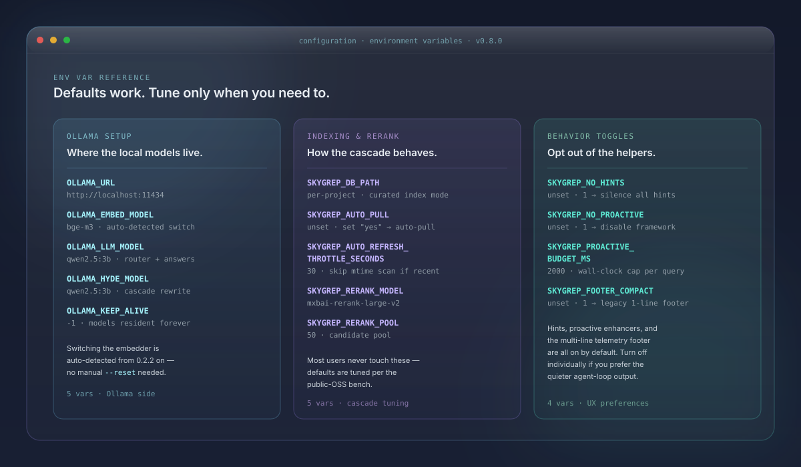

<p align="center">
  
</p>

<p align="center">
  <a href="https://pypi.org/project/skylakegrep/"></a>
  <a href="https://www.python.org/downloads/"></a>
  <a href="LICENSE"></a>
  <a href="https://danielchen26.github.io/skylakegrep/"></a>
  <a href="https://github.com/danielchen26/skylakegrep/releases/latest"></a>
</p>

<p align="center">
  <a href="#install"><b>Install</b></a>
  &nbsp;·&nbsp;
  <a href="#three-ways-people-use-it"><b>Scenarios</b></a>
  &nbsp;·&nbsp;
  <a href="#new-in-080-token-lean-agent-loop"><b>New in 0.8.0</b></a>
  &nbsp;·&nbsp;
  <a href="#why-skylakegrep"><b>Why?</b></a>
  &nbsp;·&nbsp;
  <a href="#how-it-works"><b>How it works</b></a>
  &nbsp;·&nbsp;
  <a href="#performance"><b>Benchmarks</b></a>
  &nbsp;·&nbsp;
  <a href="https://danielchen26.github.io/skylakegrep/"><b>Docs site</b></a>
</p>

---

# Find anything on your machine.

> **Smart semantic search, fast enough to feel instant.** Ask in
> plain English — or any of 100+ languages — and get back the
> right file and line range in about a second, even when the
> working directory isn't the right project. Fully offline.

**Semantic search for code, PDFs, notes, and docs.** Fully offline.
No cloud. No telemetry. No subscription. Ask in plain English (or
any of 100+ languages) and get the right file + line range. Scoped
location and lexical-friendly queries usually return sub-second; deeper
semantic retrieval stays bounded and reports its route while it works.

```console
$ skygrep "where does the auth token get refreshed?"

═══ auth/middleware.py:78-94          score 0.91 · python
async def renew_session(req: Request):
    # swap the access cookie when the refresh JWT is still valid
    if req.cookies.get("rt") and access_expired(req):
        return await refresh_token(claims, key)

╰─ done   0.5s · quality=BEST
   path     : cosine-cheap (high-confidence early-exit)
   evidence : σ-gap=0.082 ≥ τ=0.005 (adaptive)
```

[**Install in 30 s →**](#install) &nbsp;·&nbsp;
[How it works →](#how-it-works) &nbsp;·&nbsp;
[Benchmarks →](#performance)

> **60** pinned public benchmark tasks &nbsp;·&nbsp;
> **92.5 %** retrieval-context quality &nbsp;·&nbsp;
> **508-token** compact agent anchors (0.8.0) &nbsp;·&nbsp;
> **100 %** local &nbsp;·&nbsp;
> **58** releases shipped

---

## Three ways people use it

### 🧠 Code by concept

Find code by what it does, not what it's called. The semantic
substrate (`bge-m3`) bridges your phrasing to the actual identifier
even when the function name uses different words.

```console
$ skygrep "where does session refresh logic live?"

→ auth/middleware.py:78  ·  renew_session()
```

> No `rg` hit for *"session refresh"*; semantic retrieval bridges to
> `renew_session` from the project index.

---

### 📄 Cross-content

One query across code, PDFs, notes, and docs. Markdown, PDF,
Word, plain text — all indexed via the same content-agnostic
substrate. Your query searches all of them at once, ranked by
semantic relevance.

```console
$ skygrep "the design doc on rate limiter rewrite"

→ docs/rate-limiter-redesign.md  ·  designs/q3-rewrite.pdf
```

> Markdown link graph + PDF text-layer extraction in one cascade.

---

### 🌐 Multilingual · private

`bge-m3` understands 100+ languages out of the box. Index,
retrieval, ranking, optional answer synthesis — all run locally
via Ollama. Zero network calls.

```console
$ skygrep "我昨天写的 cascade 调度代码"

→ src/storage.py:847  ·  cascade_search()
```

> Mixed Chinese / English query. Zero network. Audit-friendly.

---

## New in 0.8.0 (token-lean agent loop)

- Agent presets return **compact JSON** (`--agent-fast` 3,331 → 508 tokens on
  the same query); `--format full` keeps the 0.7.x shape.
- **`skygrep --agent-slim`** adds a query-ranked declaration outline of the
  top 3 source files; **`skygrep symbols`** outlines the next ones.
- Indexes left without embeddings while Ollama was down are now repaired by
  `skygrep index .`.

Details: [release notes](docs/skylakegrep-0.8.0.md).

## Highlights

### 🚀 Just ask — no `skygrep index .`

The first query in a fresh repo works. A background process builds
the semantic index while a `rg` fallback handles your first turn;
from the second query on, the full cascade is online.

```console
$ cd /path/to/brand-new-project
$ skygrep "how does auth handle expired tokens?"

→ src/auth/token.py:140  ·  refresh_or_redirect()
```

> Cold-start vocabulary-mismatch: **0/10 → 4/10** over plain `rg`
> on the Django oracle bench (0.5.3, real-CLI verified).

---

### 🧭 Smart from the wrong folder

Run skygrep from `/tmp` and ask about a real project. The router
dispatches **two retrieval lanes in parallel**; a proactive umbrella
that searches sibling roots in `SKYGREP_PROACTIVE_DIRS` can answer
before the cascade has time to run its first rerank.

```console
$ cd /tmp/scratch
$ skygrep "where does the parallel umbrella dispatch?"

→ ~/code/skylakegrep/src/cli.py:912  ·  cascade ‖ proactive umbrella
```

> Wrong-cwd discovery is bounded. Set `SKYGREP_PROACTIVE_DIRS` or pass
> an explicit scope when an agent already knows where to look.

---

### 🧠 Streaming intelligent routing

Each query is classified by a local LLM router (`qwen2.5:3b`) for
intent / scope / primary token, then dispatched to multiple lanes
in parallel. Each result lands tagged with the route it came from
and the still-searching status of the others — never silent, always
honest about what's pending.

```console
$ skygrep "the design doc on rate limiter rewrite"

├─ proactive umbrella · filename glob
│             cascade still searching
═══ docs/rate-limiter-redesign.md:1

╰─ done   0.4s · quality=BEST
   path   : proactive + cascade
   router : llm -> intent=mixed
```

> Confidence-streaming: results stream as they're ready, tagged with
> the route they came from. Each answer's provenance is auditable.

---

### 🔍 Why this matched · `skygrep -x`  *(new in 0.5.8)*

Every retrieved chunk now carries the full provenance of how it got
there. Pass **`--explain`** (or **`-x`**) and skygrep prints a one-line
**router rationale** at the top, a **per-result `via:` line** under
each header showing which channel(s) contributed, and a **cascade-lane
summary** showing the σ-adaptive evidence at the bottom. No new model
calls, no extra retrieval — every signal was already in the pipeline.

```console
$ skygrep -x "find pyproject.toml in this repo"

├─ route      router: filename · primary_token="pyproject.toml" · conf=0.95 · source=llm
│             reason: "user is looking for a specific file by name in the repo"

╭─ pyproject.toml ────────────────────────────────── [toml]  1.000
│ via: filename-lookup · token "pyproject.toml" · score=1.000
│
│ size:  1.0 KB    modified: 2026-05-06 16:51    type: toml
╰──────────────────────────────────────────────────────────────────

├─ cascade   lane: cosine-cheap (gap=0.037, tau=0.016)
```

> Three layers answer three different "why" questions:
> **what intent** the LLM router inferred, **which channel** retrieved
> this chunk (cosine cascade · symbol RRF · filename-lookup · ripgrep
> shortcut), and **which lane** answered. Bonus 0.5.8: if Ollama isn't
> running, skygrep starts it in the background and tells you — no more
> silent rule-based fallbacks.

---

## Why skylakegrep?

Sized against **four named alternatives**, not generic categories.

<p align="center">
  
</p>


---

## How it works

<p align="center">
  
</p>

**Local Ollama + SQLite. Zero network calls. Zero subscription.**
The same architecture handles every content type — code · PDFs ·
notes · markdown · any file you register an extractor for.

The LLM router classifies *intent + scope + primary token* on every
query. Two retrieval lanes then **race in parallel** — not in
series:

  - **σ-adaptive cosine cascade** — when the working directory is
    indexed and right, `bge-m3` (multilingual, 1024-d, symmetric
    XLM-RoBERTa) ranks files; high-confidence queries early-exit
    on cheap cosine, uncertain ones escalate to a cross-encoder
    rerank. A tree-sitter symbol channel and hybrid lexical RRF
    fusion fold in alongside, with a reference-graph PageRank
    tiebreak.
  - **Proactive umbrella** — four tiers run concurrent with the
    cascade (not after it): `filename_extend` for fast filename
    matching, `lazy_cwd` for auto-indexing the current folder,
    `lazy_cross_folder` for sibling roots in
    `SKYGREP_PROACTIVE_DIRS`, and a streaming dispatcher that
    posts each answer as it lands.

The first confident answer streams to your terminal — refinements
arrive as later lanes finish. ~1 s typical, even when the working
directory is the wrong project (0.5.7, real-CLI verified).

[Architecture deep-dive →](https://danielchen26.github.io/skylakegrep/)

---

## How skylakegrep differs from Elasticsearch

<details>
<summary><b>For people asking "why not just use ES?"</b></summary>

**Different niche, different design.** Elasticsearch is a multi-tenant,
TB-scale, distributed search engine for data centers. skylakegrep is
a single-user, single-machine, zero-ops CLI for a developer asking
their own laptop a question. Both can be called "search engines";
they answer different problems.

| | skylakegrep 0.7.0 | Elasticsearch |
|---|---|---|
| **Setup** | `python3 -m pip install --user skylakegrep`; cold-start lazy auto-trigger | JVM, cluster, mappings, ingest pipeline, dense-vector plugin, reindex |
| **Semantic retrieval** | bge-m3 (1024-d, 100+ languages) via local Ollama, out of the box | Manual: pick embedder, pipeline, dimension, reindex |
| **Intent understanding** | qwen2.5:3b LLM router classifies intent / scope / primary token per query | None natively; you write query DSL by hand |
| **Code AST awareness** | tree-sitter symbol channel, RRF-fused with cosine | None; code is plain text |
| **Cold-start / wrong-folder** | `lazy_cwd` + `lazy_cross_folder` 4-lane parallel umbrella, ~1.1 s | Empty index = 0 results |
| **Why-this-matched explainability** | `--explain` shows router rationale + channel breakdown + lane evidence | BM25 highlight only |
| **High-risk local verification** | `--strict` requires independent hybrid/semantic agreement plus indexed-source freshness; inconclusive evidence exits `2` | Application-specific validation required |
| **Cross-file context** | reference-graph PageRank tiebreak | None |
| **Privacy / offline** | 100 % local by design | Index can be local, but most embeddings are external API calls |
| **Latency p95 (single repo, 50k files)** | 0.3 – 1.1 s including LLM router | ms-level *after* you've paid the operational cost |
| **Scale** | single-machine, single-repo sweet spot | billions of docs, multi-shard, distributed |
| **Multi-tenant / ACL** | not designed for this | first-class |
| **Aggregations / facets / time-series** | not designed for this | first-class |
| **Operational cost** | zero (no daemon, no GC tuning, no shard rebalance) | non-trivial (GC, heap, shard rebalance, monitoring) |

**Where skylakegrep wins:** "I just opened my terminal and want to find
something on my own machine." Easier, more semantic, more code-aware,
more private — and now (0.5.8) it can also tell you *why* it picked
each result.

**Where Elasticsearch wins:** anything that needs scale, multi-tenant
isolation, faceted aggregations, or production-grade replication.
We don't try to compete in those rooms.

> ES is the search engine of the data center. skylakegrep is the
> search engine of your developer terminal.

</details>

---

## Install

```bash
# 0. confirm Python 3.9+ is available
python3 --version

# 1. install with the same Python that will own the CLI
python3 -m pip install --user skylakegrep

# 2. pull the local models, one command per model
ollama pull bge-m3
ollama pull qwen2.5:3b

# 3. verify runtime, models, install path, and index state
skygrep doctor

# 4. (one time) register skygrep with your LLM CLI of choice
skygrep setup     # Claude Code · Codex · OpenCode · Gemini CLI · Pi · Cursor

# 5. ask anything, anywhere
skygrep "your question here"
```

`skygrep setup` writes a short agent rule into Claude Code, Codex,
OpenCode, Gemini CLI, Pi, and Cursor when detected. The rule tells the
agent which depth to request: path-only `--no-content --top 10 --no-rerank` for implementation
anchors, first-pass `--content --detail standard --top 8 --no-rerank` for source snippets,
`--detail full` only after narrowing, `--answer` for local synthesis,
and `--json` plus `--include` for machine-readable scoped tool calls.
Re-running `skygrep setup` refreshes the
managed block when these instructions improve. After an upgrade, normal
`skygrep` searches and `skygrep doctor` also refresh already-registered
managed blocks automatically; new integrations still require an explicit
`skygrep setup`.

On macOS, `python` may not exist; use `python3`. If `skygrep` installs but
the shell cannot find it, inspect:

```bash
python3 -m site --user-base
which -a skygrep
python3 -m pip show skylakegrep
```

The user-site script commonly lives under
`~/Library/Python/3.x/bin/skygrep`; add that `bin` directory to `PATH`
or use a virtual environment.

```bash
export PATH="$(python3 -m site --user-base)/bin:$PATH"
```

If setup gets tangled across multiple Python installs, reset cleanly:

```bash
# Remove LLM-CLI snippets written by `skygrep setup`.
skygrep setup --uninstall || true

# Remove the Python package from the Python that installed it.
python3 -m pip uninstall -y skylakegrep

# Optional: delete local indexes/config. This does not delete your files.
rm -rf ~/.skylakegrep

# Optional: remove downloaded Ollama models.
ollama rm bge-m3
ollama rm qwen2.5:3b

# Reinstall from a clean state.
python3 -m pip install --user --no-cache-dir skylakegrep
ollama pull bge-m3
ollama pull qwen2.5:3b
skygrep doctor
```

That's it. The first query in a fresh project completes in under
a second via a `ripgrep` fallback while a background process
builds the semantic index. Every query after that uses the full
cascade with the local LLM kept warm in memory.

---

## Performance

The current release-scale performance contract is
[General Benchmark v2](docs/general-performance.md): six public repositories
at exact commits, 60 source-evidence tasks, real `tiktoken` counting, paired
quality gates, measured retrieval latency, and repository-aware confidence
intervals. It publishes an efficiency multiplier only after skygrep is
non-inferior to `rg-only` on completion and retrieved-context quality.

The 2026-08-15 clean-source receipt passed those gates. Across the 53 / 60
unique tasks where both policies met the same quality floor, `skygrep-first`
returned **17.982× less tool context at the median** (repository-aware 95% CI:
**5.202×–94.127×**) while retrieval-context quality was 92.5% versus 88.4%.
This is a paired retrieval-context result, not a universal runtime claim:
skygrep used more tool calls overall, and the quality-eligible median task was
slower in the measured harness even though all-row aggregate elapsed favored
skygrep. The `rg-only` baseline returns every per-file match (median 13.8M
tokens per Spring task), so the ratio is against an unbounded dump rather than
an agent that truncates tool output; 0.8.0 adds a realistic `rg-agent`
baseline and the token-lean `skygrep-slim` policy for that comparison. See the
[full result and boundaries](docs/general-performance.md) and
the [immutable raw receipt](benchmarks/reports/general-v2-2026-08-15.json).

Two older results remain useful for regression history, but are not general
performance claims:

- The 0.7.0 deterministic six-task CI fixture reported 4.05× less context than
  a modeled raw-`rg` loop with equal checked path/evidence coverage. It is a
  fast per-PR contract, not a cross-repository multiplier.
- The earlier Django/React/Tokio parity page reported 30/30 top-10 recall and a
  60×–770× context range against a deliberately broad term-OR dump. It used a
  legacy tokenizer/task protocol and moving repository tips, so the figures are
  retained only as a historical engineering receipt.

Reproduce the current pinned fixture and methodology with:

```bash
.venv/bin/python benchmarks/validate_public_fixtures.py \
  --oss-root /tmp/skygrep-general-v2-repos --prepare

.venv/bin/python benchmarks/universal_closed_loop_benchmark.py \
  --oss-root /tmp/skygrep-general-v2-repos \
  --prepare --refresh-index --reset-index \
  --index-timeout 18000 \
  --trials 3 --tokenizer tiktoken \
  --report /tmp/skygrep-general-v2.json --summary-only
```

See the [current methodology](docs/general-performance.md) and the
[historical parity receipt](docs/parity-benchmarks.md) for their distinct
claim boundaries.

### Closed-loop agent benchmark (0.5.14)

0.5.14 extends the agent benchmark from one-shot context retrieval to a
closed-loop workflow: first find likely paths, then gather enough
evidence for the next reasoning step, then score whether the context is
sufficient for a downstream LLM to act. It compares a skygrep-first
policy (`--json`, scoped includes when known, path-only probes,
`--no-rerank` for first-pass evidence, direct file reads after
narrowing) against a raw-`rg`-only agent over 38 generic tasks across
this repo plus Django, React, and Tokio.

| Metric | `skygrep-first` | raw `rg-only` |
| --- | ---: | ---: |
| Tasks | 38 | 38 |
| Path coverage | 94.7 % | 100.0 % |
| Path precision | 10.9 % | 3.4 % |
| Evidence coverage | 99.1 % | 99.3 % |
| Sufficiency score | 96.5 % | 99.7 % |
| Completed tasks | 35 | 38 |
| Tool calls | 322 | 337 |
| Raw retrieval elapsed | 154.23 s | 327.73 s |
| Estimated agent elapsed | 161.68 s | 3833.97 s |
| Context tokens | 223,592 | 105,187,419 |
| Work quality / minute | 12.829 | 0.561 |

Historical reading: this 0.5.14 self + three-repository fixture reported
**470× less context**, **23.7× lower modeled agent elapsed**, and **22.9×
higher modeled work-quality-per-minute**. Those figures used a legacy task
contract in which many public path-only tasks had no literal evidence terms;
they are retained as a historical receipt, not as a current general claim.
Raw `rg` remains the raw-output ceiling when an agent truly needs every
lexical match. General Benchmark v2 replaces this headline with pinned public
fixtures, non-empty source evidence, exact tokenization, paired quality gates,
and confidence intervals. In 0.5.17, the first-pass
`--agent-context` parity bench closes the earlier recall gap on 30
repository-maintenance tasks by using `rg` as an internal bounded recall
lane instead of exposing raw grep output to the LLM.

Pull-request CI also runs `benchmarks/ci_agent_contract_benchmark.py` through
`benchmarks/closed_loop_regression_gate.py`. The six-task, model-free fixture
executes the real hybrid candidate-recall code and fails the build if path or
evidence coverage, sufficiency, context reduction, estimated agent elapsed,
or work-quality-per-minute drops below the checked thresholds. The larger
real-repository/Ollama benchmark remains the release-scale gate.

---

## What you can search

The retrieval substrate is **content-agnostic** by design. The
embedder, the cascade, and the reference graph all abstract over
"A references B" — not over any specific programming language or
file format. New content types plug in via a one-line
`register_extractor()` call.

<p align="center">
  
</p>


```python
from skylakegrep.src.reference_graph import register_extractor

def yaml_anchor_extractor(path):
    """Return list of (source, target) reference edges."""
    ...

register_extractor("yaml", [".yaml", ".yml"], yaml_anchor_extractor)
```

---

## Command cheatsheet

The **bare form** — `skygrep "<your question>"` — covers ~95 % of
real-world use. No subcommand, no flags. The system auto-routes
(LLM router → `find` / `rg` / semantic cascade), auto-indexes on
first query, and auto-recovers when the embedder is upgraded.

<p align="center">
  
</p>

### Choose the right information depth

The same natural-language question can ask for different levels of
evidence. Keep the first query cheap; only ask for more depth when the
task needs it.

| Goal | Command |
|---|---|
| Locate the file or folder quickly | `skygrep "where is the project brief I edited recently?"` |
| Show relevant source/document snippets | `skygrep --content --detail standard "what does the API migration plan say about rollback?"` |
| Read deeper after narrowing to one path | `skygrep --content --detail full --include "docs/migration-plan.md" "show the deployment steps"` |
| Quick deep-read shorthand | `skygrep --detail "show the deployment steps"` |
| Synthesize a local answer from retrieved evidence | `skygrep --answer --content "summarize the payment retry policy"` |
| Token-lean first call for an LLM agent | `skygrep --agent-slim "where is token refresh implemented?"` — compact anchors plus a query-ranked declaration outline of the top 3 source files |
| Outline the next candidate files | `skygrep symbols auth/session.py auth/jwt.py -q "token refresh"` — `line: declaration` rows, no index or model needed |
| Fast path anchors for an LLM agent | `skygrep --agent-fast "where is token refresh implemented?"` |
| Feed compact structured context to an LLM agent | `skygrep --agent-context --include "src/**" "where is token refresh implemented?"` |
| Verify a high-risk local claim | `skygrep --strict "where is authorization enforced?"` — hybrid recall + an independent corpus-wide semantic pass + indexed-source freshness; exits `2` when still inconclusive. |
| Reuse a daemon for repeated agent calls | `skygrep serve --port 7878` then `skygrep --agent-daemon --agent-context "what does token refresh do?"`; add `--warm-reranker` only when later reranked queries justify the memory/startup cost |
| Audit why a route/result was chosen | `skygrep --explain "where is token refresh implemented?"` |

### Option playbook for humans and agents

Choose options by the **kind of answer the next step needs**, not by
habit. The best call is usually the shallowest call that can produce
enough evidence.

| Problem shape | Use | Why |
|---|---|---|
| "Where is X?" / "Which file handles X?" | `skygrep --agent-fast "where is token refresh implemented?"` | Path-only, high-recall anchors; cheap first pass for agents. |
| "What does X say about Y?" | `skygrep --agent-context "what does the migration plan say about rollback?"` | Fast first-pass snippets and line ranges without dumping full files. Re-run without the preset only if rerank is needed for ambiguity. |
| "Read this known file/folder deeply" | `skygrep --content --detail full --include "docs/migration-plan.md" "show the deployment steps"` | Full depth only after scope is known; avoids repo-wide context blowups. |
| "Summarize / answer from local evidence" | `skygrep --answer --content "summarize the payment retry policy"` | Retrieves evidence first, then synthesizes locally through Ollama. When a living policy/reference document leads, unrelated snapshots and planning notes are excluded unless the query names them. |
| "An LLM/agent will consume this" | `skygrep --agent-context --include "src/**" "where is token refresh implemented?"` | Machine-readable, compact, and scoped; do not scrape human terminal output. |
| "This local claim is high-risk" | `skygrep --strict "where is authorization enforced?"` | Implies agent context and emits `strict_verification`; exit `2` means the evidence must not be treated as verified. |
| "Several implementation files may matter" | `skygrep --json --no-content --top 10 --no-rerank --no-llm-router --no-cascade "where is request routing assembled?"` then read returned files | Separates path discovery from file reading; improves closed-loop agent quality without paying router/cascade model calls. |
| "The query is broad or noisy" | Add `--include`, `--exclude`, `--language`, or run from the relevant project root | Scope is the largest latency and accuracy lever. |
| "I need to audit routing" | `skygrep --explain "why is this policy selected?"` | Shows router intent, contributing lanes, and cascade evidence. |
| "I need exact regex output" | Use `rg` directly | `skygrep` is for natural-language search, not regex authoring. |

Agent presets (`--agent-fast`, `--agent-context`, `--agent-slim`) emit
compact JSON: one line, paths relative to the current directory, no
duplicated anchor blocks, and snippets trimmed to the declaration plus the
lines that mention the query (`--snippet-budget` to change). The keys agents
read are unchanged; `--format full` restores the legacy pretty-printed
shape for debugging.

Closed-loop agent policy (token-lean):

1. Start with `skygrep --agent-slim "<query>"`. If an outline row looks like
   the answer, read only that line range. Otherwise run the `next` command
   it returns (`skygrep symbols <next 3 files> -q "<query>"`), at most
   twice, then follow `agent_summary.suggested_followup_probe`. Use
   `skygrep --agent-context "<query>"` when the next step needs snippets
   rather than an outline; it fuses path tokens, symbols, bounded ripgrep
   recall, source-type priors, and compact chunk evidence.
2. If the caller already knows the repo, folder, or file, add
   `--include "<scope/**>"` immediately. Scoped calls are faster and
   reduce false positives.
3. Read candidate files directly when the agent has a file-read tool.
   Use `--detail full --include "<path>"` only when direct reads are
   unavailable or skygrep extraction is needed for PDFs, docx, or other
   parsed documents.
4. Use `--answer` only when the user asked for a synthesized answer.
   For code modification tasks, prefer source evidence over synthesis.
5. Use bounded `rg -l` / targeted `rg` only when exact lexical/regex
   matching is required or when you need raw grep output. Low-confidence
   agent results include `agent_summary`, `confidence_basis`, `why_ranked`, and a targeted
   follow-up probe so the next step can stay scoped.
6. For security, release, legal, financial, destructive, or other high-risk
   local claims, use `--strict` even when the first-pass quality is `best`.
   Strict mode independently checks corpus-wide semantic agreement and source
   freshness; only `strict_verification.status=passed` is a verified result.

For repeated GPT / Cloud Code / Superconductor-style tool calls, keep
the process available with `skygrep serve --port 7878` and call
`skygrep --agent-daemon --agent-fast ...` or
`skygrep --agent-daemon --agent-context ...`. `--agent-daemon` uses
`SKYGREP_DAEMON_URL` when set, otherwise `http://127.0.0.1:7878`, and
falls back in-process if no daemon is running. The server binds before any
optional reranker load and does not warm that heavyweight dependency by
default. Use `skygrep serve --warm-reranker` when the workload actually uses
reranking and you want to pay the warmup once in the background. Direct and
daemon `--agent-context` requests use the same hybrid evidence implementation,
so daemon speed no longer trades away candidate-recall lanes or agent summaries.

Agent presets default to rule-based routing, no cascade, and confidence-aware
first-pass evidence for bounded latency. If the compact evidence is degraded,
`--agent-context` can add one cheap semantic file-rank pass; add
`--llm-router`, `--cascade`, or rerank only when ambiguity is worth paying a
local model call or deeper semantic refinement.

Agent rule of thumb: run from the relevant project root, or pass
`--include` / `--lexical-root` when the scope is known. Start bare for
**where / locate / which file** questions; add `--content` for **what
does it say / explain / summarize** questions; add `--json` whenever
another LLM will consume the result. Avoid broad home-directory semantic
queries unless the user really wants cross-folder discovery; they are now
bounded, but scoped queries are both faster and more accurate.

### Reading the per-query telemetry footer (0.2.2+)

Every search prints a structured workflow footer so you can see *which*
retrieval path answered your query and *why* without parsing a long line:

```
╰─ done   0.42s · quality=BEST
   path     : cosine-cheap (high-confidence early-exit)
   router   : llm -> intent=mixed (0.83)
   evidence : σ-gap=0.0820 ≥ τ=0.0050 (adaptive)
   pool     : 1 filename + 0 lexical · cascade
   index    : 20s ago · 36 files · L2 symbols + graph prior
```

Field guide:

  - **`path=`** — `cosine-cheap` / `cosine-escalated-rerank` /
    `rg-only` / `cascade-skipped`. The retrieval strategy this
    specific query took.
  - **`σ-gap=… → reason`** — Bayesian-evidence proxy that drove
    the cascade decision. High σ-gap = top-K candidates well
    separated → cosine trusted, exit cheap. Low σ-gap = candidates
    tied → escalate to rerank.
  - **`recovery=…`** *(only when the recovery worker is active)* —
    live progress + ETA for the in-progress re-embed.
  - **`quality=BEST` / `DEGRADED-recovery`** — at-a-glance trust
    indicator.

---

## Configuration

Set via environment variables. Defaults work — tune only when you
need to. Grouped into three panels: Ollama setup, Indexing & rerank,
Behavior toggles.

Cold-start lazy semantic search is intentionally budgeted. If a first
query says it hit the foreground budget, either scope the query
(`--include "docs/**"` / run from the right project root) or
raise the foreground knobs:

```bash
export SKYGREP_COLD_LAZY_TOTAL_BUDGET_S=15
export SKYGREP_COLD_LAZY_CWD_BUDGET_S=10
export SKYGREP_COLD_LAZY_CROSS_BUDGET_S=4
export SKYGREP_COLD_LAZY_SEED_BUDGET=24
```

The default stays conservative so broad home-folder searches cannot
block the terminal for minutes. Background indexing continues after the
foreground budget expires.

Full and incremental indexing batch chunks across file boundaries so small
files share embedding requests. `SKYGREP_INDEX_BATCH_SIZE` controls the bounded
batch size (default `64`, clamped to `1..512`) for unusual local-model or memory
constraints.

Interactive terminals animate only the narrow left workflow rail during
foreground semantic waits. The rail uses a three-cell particle stream with
blue/cyan/white coloring; captured output, `--json`, logs, and agent
tool calls stay stable. Turn it off if you prefer fully static progress:

```bash
export SKYGREP_UI_ANIMATION=off
```

The result workflow rail stays compact and copyable by default. To force
an alternate rail:

```bash
export SKYGREP_UI_RAIL=tree    # or: helix
```

The `helix` rail replaces box connectors with a denser three-cell rotating
particle field (`• ·`, ` ·•`, `· •`, `•· `) plus a slim separator line, so
the workflow itself reads like one continuous vertical particle stream
through progress, results, and the final routing footer.

Interactive terminals show Nerd Font step icons by default. Disable them
if your terminal font does not support patched glyphs:

```bash
export SKYGREP_UI_ICONS=off
```

Captured output and agent/tool paths keep plain labels unless icons are
explicitly requested.

<p align="center">
  
</p>


---

## Release notes

Current release: **0.8.0** — token-lean agent loop
([notes](docs/skylakegrep-0.8.0.md)). Full history lives on the
[changelog](https://danielchen26.github.io/skylakegrep/changelog.html) and
[GitHub Releases](https://github.com/danielchen26/skylakegrep/releases).

---

## Project principles

Architecture rules every contributor (human or AI agent) should
follow. Recorded in
[`docs/principles.html`](docs/principles.html). Loaded into Claude
sessions automatically via `CLAUDE.md`.

  1. **Understanding > Enumeration** — substrate (LLM / embedder
     / registry) over hardcoded lists. Receipts table tracks 5
     past lapses.
  2. **Substrate before scaffolding** — upgrade the underlying
     model before layering priors on top.
  3. **Latency / quality / correctness** — in that priority order.
  4. **Public surfaces sync at every release** — the 8-surface
     checklist in [`docs/releasing.html`](docs/releasing.html).
  5. **Honest evaluation over hopeful claims** — name the bench,
     show the numbers, don't combine across benches.
  6. **Proactive over Passive** — when the cascade can't answer,
     try bounded extra work in parallel rather than shrug.

---

## Development

```bash
git clone https://github.com/danielchen26/skylakegrep.git
cd skylakegrep
python3 -m venv .venv
source .venv/bin/activate
pip install -e .[rerank]

# Verify
.venv/bin/python -m pytest -q tests/        # current suite should pass
```

The release protocol is documented in
[`docs/releasing.html`](docs/releasing.html). Every release must
sync 8 public-facing surfaces (PyPI, GitHub Release, README,
GitHub Pages, plan docs, principles, version bump, tag) in a
specific order.

---

## License

Apache License 2.0 — see [`LICENSE`](LICENSE) and [`NOTICE`](NOTICE).
Commercial use, modification, and redistribution are permitted under
those terms. The names *skylakegrep* / *skygrep* are trademarks; see
[`TRADEMARK.md`](TRADEMARK.md) for naming policy (Apache does not grant
trademark rights).

---

## Acknowledgments

Built on the shoulders of:

  - [Ollama](https://ollama.com) — local model serving
  - [bge-m3](https://huggingface.co/BAAI/bge-m3) — multilingual
    embedder (BAAI)
  - [qwen2.5](https://huggingface.co/Qwen/Qwen2.5) — local LLM
    family for routing + answer synthesis
  - [tree-sitter](https://tree-sitter.github.io) — symbol-aware
    chunking
  - [SQLite](https://www.sqlite.org/) — durable index storage
  - [pypdf](https://pypdf.readthedocs.io) · [python-docx](https://python-docx.readthedocs.io) — binary content extraction
  - [Pygments](https://pygments.org) — syntax highlighting in the
    rendered terminal output
