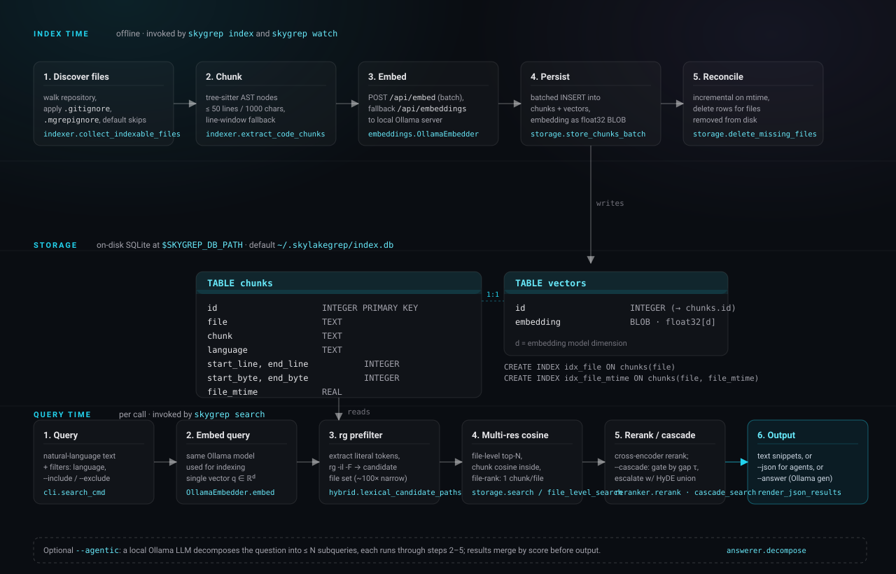

# Documentation

This directory contains the documentation site for `skylakegrep`. The
[`index.html`](index.html) file is the rendered site published to GitHub Pages.
The Markdown files here are reference companions to that site.

## Contents

| File | Purpose |
| --- | --- |
| [`index.html`](index.html) | Rendered documentation site (published as <https://danielchen26.github.io/skylakegrep/>). |
| [`skylakegrep-0.1.0.md`](skylakegrep-0.1.0.md) | First public release notes — full description of capabilities, three-tier routing, semantic cascade, PDF/docx extraction, CLI flags, environment variables, license terms. |
| [`token-benchmarking.md`](token-benchmarking.md) | Methodology and full results for the deterministic context-gathering benchmark. |
| [`parity-benchmarks.md`](parity-benchmarks.md) | Cross-repo retrieval benchmarks: cascade ablations, multi-language recall, end-to-end agent benchmark protocol. |
| [`skylakegrep-0.5.14.md`](skylakegrep-0.5.14.md) | Closed-loop agent workflow release notes, daemon-first guidance, and benchmark summary. |
| [`roadmap.md`](roadmap.md) | What's planned for future versions. |
| [`assets/`](assets) | SVG figures referenced by the site and the project README. |

## Reading order

1. The [project README](../README.md) for installation and a one-page summary.
2. [`skylakegrep-0.1.0.md`](skylakegrep-0.1.0.md) for the full
   description of what the project does today — capabilities,
   architecture, CLI flags, environment variables.
3. [`token-benchmarking.md`](token-benchmarking.md) for the benchmark protocol,
   limitations, and the conditions under which the published numbers are valid.

## Architecture at a glance



`skylakegrep` is organized as two pipelines that meet at a single SQLite
database. The index pipeline (`skygrep index`, `skygrep watch`) discovers source
files, chunks them, embeds them through a local Ollama server, and writes the
result to disk. The query pipeline (`skygrep search`) reads from the same
database, scores candidates with a hybrid cosine + lexical formula, applies
span deduplication and per-file diversification, and returns the top-k as text,
JSON, or a synthesized answer.

## Reproducing the published benchmark

```bash
.venv/bin/python benchmarks/agent_context_benchmark.py --top-k 10 --summary-only
.venv/bin/python benchmarks/agent_tool_depth_benchmark.py --summary-only
.venv/bin/python benchmarks/universal_closed_loop_benchmark.py --repo self --repo django --repo react --repo tokio --summary-only
```

See [`token-benchmarking.md`](token-benchmarking.md) for definitions, the full
results table, and an explicit list of what the benchmark does not measure.
See [`benchmarks.html`](benchmarks.html) for the 0.5.14 closed-loop agent
benchmark framing.
