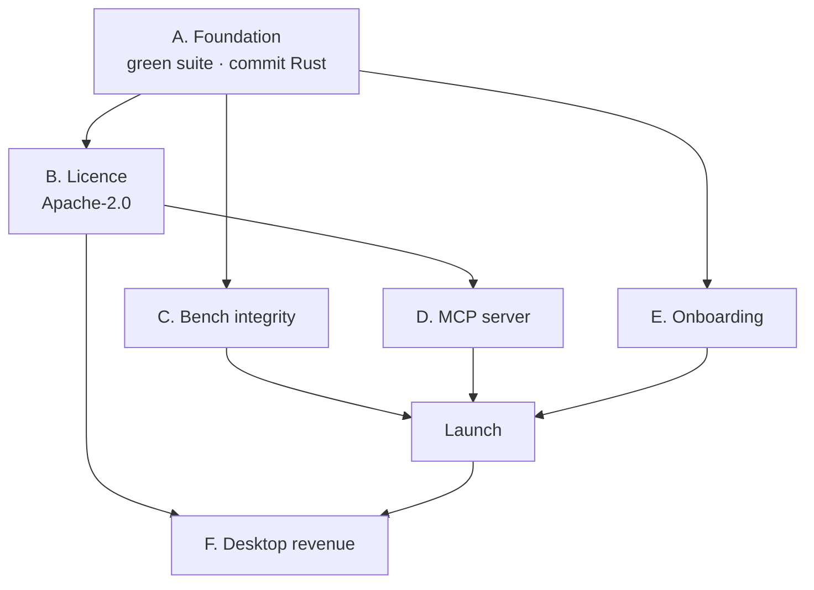

# skylakegrep — Product Improvement Plan

Date: 2026-08-17
Audience: maintainer / next coding agent
Status: audit complete; P0 items partly executed (see §1)

Supersedes the sequencing in
[`2026-08-14-apache-mcp-bench-launch-plan.md`](2026-08-14-apache-mcp-bench-launch-plan.md)
where they conflict. That plan's technical analysis remains valid and is
referenced throughout rather than repeated.

This document answers one question: **what has to change for this app to be
good enough that people adopt it and pay for it?**

---

## 0. Audit findings (measured 2026-08-17, not assumed)

Everything below was verified against the working tree, not inferred.

| Dimension | Measured state | Verdict |
|---|---|---|
| Test suite | **388 passed / 17 failed** at audit start | 🔴 was masking a real bug |
| Git object DB | `git fsck` broken link; `rev-list HEAD` **fatal** | 🔴 release workflow blocked |
| Working tree | Rust workspace (`Cargo.toml`, `apps/`, `crates/`) **untracked** | 🔴 26 MB of product unversioned |
| Licence | PolyForm-NC 1.0.0; GitHub reads `NOASSERTION` | 🔴 blocks all adoption |
| Stars / adoption | **0 stars**, PyPI 0.7.0 published | 🔴 no distribution |
| Governance files | `NOTICE`, `CONTRIBUTING`, `SECURITY`, `CODE_OF_CONDUCT` **all absent** | 🟡 |
| MCP server | **does not exist** (no `mcp` anywhere in `pyproject`/`src`) | 🔴 no agent distribution |
| `schema_version` in JSON | **not implemented** | 🟡 no consumer compat story |
| Benchmarks | v2 **already pins commits** + real tokenizer + `--report` | 🟢 much better than assumed |
| Committed report artifact | `benchmarks/reports/` **does not exist** | 🔴 headline unbacked |
| Dead bench scripts | **10 of 28** hard-code unreachable `/tmp` paths | 🟡 reads as abandonment |
| Repo size | **9.6 GB**, of which `target/` = 8.6 GB | 🟡 (correctly gitignored) |

### The single most important finding

**The 17 test failures were not flaky tests. They were one real product bug.**

All three `find`-based lookups passed an **absolute** root to
`find <abs-root> -not -path '*/.*'`. `find` evaluates that filter against the
*whole* path, so the hidden-path exclusion matched the project's own
**ancestors**. Any project under a hidden directory returned **zero filename
hits**, silently, with no diagnostic:

```
~/.config/myapp/          →  every filename query returns nothing
~/.local/src/project/     →  every filename query returns nothing
/path/.worktree/repo/     →  every filename query returns nothing
```

Reproduced directly, before the fix:

```
VISIBLE  /Users/…/sgprobe_visible/proj   -> FOUND
HIDDEN   /Users/…/.jcode/scratch/proj    -> NONE
```

The tests had been failing because pytest's `tmp_path` lives under a hidden
scratch root — the test fixtures were accidentally reproducing a genuine user
scenario, and the failure was being read as environmental noise.

**Lesson to institutionalise: a red suite was hiding a shipped bug for an
unknown number of releases. The suite must be green, always.**

---

## 1. Already executed in this pass

Committed as `9d60554`.

1. **Fixed the hidden-ancestor bug** in all three call sites —
   `auto_index.filename_shortcut`, `proactive._find_one_dir`,
   `query_scope._find_dirs` — by searching relative to the root (`find .`
   with `cwd=<root>`) and re-absolutising results. The filter now applies only
   to entries *inside* the project.
2. **Suite: 388 / 17 failed → 411 passed / 0 failed.**
3. **Added regression tests**, each verified to fail before the fix and pass
   after (non-vacuous): hidden-ancestor recovery, absolute-path preservation,
   and continued exclusion of hidden entries *inside* the project.
4. **Added a stale-install detector to `doctor`.** Verified against the
   maintainer's own machine, which was running **0.5.8.5 on `PATH` against
   0.7.0 source** — precisely the footgun predicted in the 08-14 plan §0.1,
   now confirmed to occur in practice.
5. **Repaired the corrupt git object database.** The missing commit object
   `fc12604c` was recovered from origin non-destructively; `git fsck` is now
   clean and `rev-list HEAD` traverses all 172 commits.

---

## 2. Strategic frame

Ordered by what actually blocks money.

> **The product is better than its distribution by a wide margin.**
> 19k lines of Python, 405+ tests, 50 releases, a genuinely novel quality
> contract — and **0 stars**, because the licence forbids the only users who
> could pay, and there is no MCP server for the agents that would use it.

Three constraints bind, in order:

1. **Licence blocks adoption.** PolyForm-NC means no company can install it.
   It filters out exactly the paying population while doing nothing to stop
   individual free use.
2. **No agent-native distribution.** MCP is how coding agents acquire tools in
   2026. Not shipping one means the product is invisible where its value is
   highest.
3. **Claims outrun evidence.** The differentiation is "the honest tool". A
   reader who cannot reproduce the headline concludes the opposite.

Everything else is a quality improvement on a product nobody can reach.

---

## 3. What we are actually good at

Be precise, because marketing generalities are what make this look like the
other five tools.

### 3.1 Defensible

**The agent quality contract.** `best / degraded / uncertain` +
`confidence_basis` + `missing_signal` + `suggested_followup_probe`. No
competitor ships a retrieval tool that tells the caller *how much to trust this
result and what to probe next*. For an autonomous agent this is the difference
between confidently wrong and correctly cautious. **This is the crown jewel and
it is currently buried below the fold in the README.**

**Measured context reduction under a quality floor.** The v2 methodology —
"how much context does a skygrep-first policy use *after both policies meet the
same quality bar*" — is a materially more honest question than competitors ask.
Pinned commits, real tokenizer, confidence intervals.

**Content-agnostic substrate.** Code + PDF + DOCX + Markdown through one
cascade, not a code-only index. Combined with fully-local execution, this is
the only credible option for regulated environments.

### 3.2 Real but not unique

Semantic search, offline/privacy, multilingual, token savings. Vera, grepai,
codanna, claude-context and SemTools each own part of this ground. **Do not
lead with any of them.**

### 3.3 Currently a liability

- Install: 5 steps, ~3 GB of models, before the first result.
- 989-line README — the crown jewel is invisible.
- 67 hand-maintained HTML twins with no generator.

---

## 4. The plan

### Phase A — Foundation (days) 🔴 blocking

**A1. Commit the Rust workspace.** 26 MB across `Cargo.toml`, `apps/`,
`crates/` is untracked. Decide the Desktop licence boundary *before*
committing (§B1) so the paper trail is right the first time. Extend
`scripts/privacy_release_scan.py:31-41` (`DEFAULT_TARGETS` omits `apps/`,
`crates/`) — the Rust tree has never been privacy-scanned.

**A2. Keep the suite green, permanently.** It just cost an unknown number of
releases to a bug hiding behind red tests. CI must fail on any failure, and no
release may proceed on a red suite.

**A3. Fix `doctor` blind spots.** The stale-install check landed. Also detect:
Ollama reachable but models absent, index stale vs working tree, and the
`urllib3`/LibreSSL warning that is the literal **first line every macOS user
sees** — suppress it or pin a compatible `urllib3`.

### Phase B — Licence + governance (hours) 🔴 highest leverage

Single-author history, 172 commits, no third-party copyright to clear. This is
mechanical. Full file-by-file map already written in the 08-14 plan §2 — follow
it exactly.

**B1.** `LICENSE` → Apache-2.0; `Cargo.toml:12` → `Apache-2.0`; add
`classifiers` + `NOTICE`.

**B2. The one line that must stop inheriting:**
`apps/desktop/src-tauri/Cargo.toml:6` is `license.workspace = true`. Flip the
workspace and the **paid** Desktop ships Apache-2.0. Set an explicit
proprietary `license-file` and `publish = false` *in the same commit*.

**B3.** Add `CONTRIBUTING.md`, `NOTICE`, `SECURITY.md`, `CODE_OF_CONDUCT.md`,
DCO check. **No CLA** unless preserving a dual-licence option (08-14 §2.4).

**B4.** Rewrite — do not delete — `docs/roadmap.md:116-118` ("MIT relicensing
… stays that way"), explaining the reasoning. Leave the 30 archived release
notes intact; rewriting history reads worse than history.

### Phase C — Benchmark integrity (days) 🔴 gates launch

Better than the 08-14 plan assumed: v2 **already** pins six commits
(`benchmarks/public_repos.json`), ships public fixtures
(`benchmarks/public_tasks/*.json`), supports `--tokenizer tiktoken`, and has a
scheduled workflow. Remaining gaps:

**C1. Commit the report artifact.** `benchmarks/reports/` does not exist. Until
a real run is committed, every published number is hand-transcribed.

**C2. Reconcile the README's own contradiction.** `README.md:62` still claims
`30 / 30` in the hero while `:427` explains that figure is historical, and
`:465` prints `99.1 %` evidence coverage that `:475` then labels as resting on
a legacy contract where many tasks had *no* evidence terms. **A reader who gets
to line 475 stops trusting line 62.** Lead with v2 numbers only.

**C3. Delete the 10 dead benchmark scripts** (verified hard-coded to
unreachable `/tmp/<repo-D>_idx_p1.db`): `cascade_probe.py`,
`cascade_production_bench.py`, `code_graph_probe.py`, `llm_arbitration_probe.py`,
`multi_hyde_probe.py`, `multi_round_probe.py`, `v0_5_diag_hard_misses.py`,
`v0_5_repo_A_bench.py`, `v0_5_targeted_enrich.py`, `v0_7_multilang_bench.py`.
36 % of `benchmarks/` cannot run on any machine.

**C4. Fix the roadmap's false claim** (`docs/roadmap.md:12-15`) about a
DOCX/PDF fixture that does not exist. Build it or move it to Planned.

### Phase D — MCP server (days) 🔴 the distribution channel

Full design already specified in 08-14 §3. Key decisions:

- **One `search` tool** with an `explain` parameter, not two.
- **Envelope the response** — `schema_version` (confirmed absent today),
  `quality`, `confidence`, `results[]`. Do not propagate the bare-array +
  `agent_summary`-only-on-`results[0]` wart.
- **Fix the empty-result ambiguity.** `SKYGREP_AGENT_MIN_EVIDENCE_SCORE`
  (default 0.50) can return `[]`, and an agent cannot distinguish "nothing
  indexed" / "nothing matched" / "suppressed as weak". Surface
  `suppressed_weak_results` + a non-empty `missing_signal`. **This is a
  correctness bug for agent callers independent of MCP.**
- `mcp` as an optional extra (SDK needs 3.10+; package floor stays 3.9).

### Phase E — Onboarding (days) 🟡 converts the traffic

**E1. Zero-dependency first result.** Ship a static-embedding fallback so the
first query works with no Ollama and no 3 GB pull. Competitors are one
`brew install`. Route selection stays automatic; `doctor` reports the live
substrate.

**E2. Kill the SSL warning** — first impression, every macOS run.

**E3. Restructure the README.** 989 lines burying the differentiator. Lead:
one-line install → one query with output → **the quality contract** →
reproduction command. Everything else moves to the docs site.

**E4. Resolve the two-engine ambiguity.** `crates/skygrep-core` (711-line
search impl) is unreachable by default behind `SKYGREP_DESKTOP_ENGINE=rust`.
Promote and measure it, or freeze and delete the gate.

### Phase F — Revenue surface (weeks) 🟢 the actual money

**F1.** Desktop is 2,800 lines of Rust + 1,977 lines of TSX and already shells
out to the real CLI. It is a productisation, not a rewrite.

**F2. Price the things a CLI cannot do:** multi-repo dashboard, stale-index
warnings, global hotkey, run history with confidence states, answer-synthesis
UI.

**F3. The enterprise wedge is the compliance report** — a signed artifact
proving zero network egress. For finance/health/legal that is a procurement
justification, not a nicety. Nothing in the local-first competitive set offers
it.

**F4.** Version Desktop independently of the engine's 8-surface protocol.

---

## 5. Sequencing



| Phase | Size | Blocking risk if skipped |
|---|---|---|
| A Foundation | days | Ship bugs blind; unversioned product |
| B Licence | **hours** | Nobody who can pay may install |
| C Bench integrity | days | **Public audit of unverifiable claims** |
| D MCP | days | Invisible to the agents that need it |
| E Onboarding | days | Traffic arrives and bounces |
| F Desktop | weeks | No revenue surface |

**Highest leverage: Phase B** (three file edits, unblocks D and F).
**Highest risk if skipped: Phase C** (the one failure that cannot be undone).

---

## 6. Launch

Only after C, D, E.

1. **Lead with the quality contract**, not "semantic search". The story is
   *"a retrieval tool that tells your agent when to distrust it."*
2. Second: measured context reduction under a quality floor, with the pinned
   reproduction command **in the first three lines**.
3. Targets: `r/LocalLLaMA`, `r/ClaudeAI`, HN. Prior art: grepai took one Reddit
   post to 1,814 stars on this exact framing.
4. **Do not claim uniqueness** on semantic search, privacy, multilingual, or
   token savings.

---

## 7. Standing principles

1. **Never ship on a red suite.** This audit's headline bug hid behind 17
   failures dismissed as environmental.
2. **Every published number needs a committed artifact.**
   `docs/PRINCIPLES.md` principle 5 is "Honest evaluation over hopeful
   claims"; the repo currently violates it on its most public figures.
3. **Test the failure mode, not just the happy path.** The hidden-ancestor bug
   was invisible because no test ran from a hidden root — until, by accident,
   they all did.
4. **A silent empty result is a bug.** `[]` with no explanation is the worst
   output this tool can produce, for humans and agents alike.
